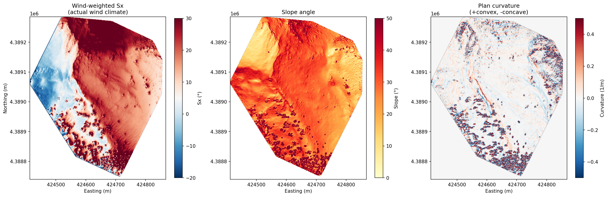
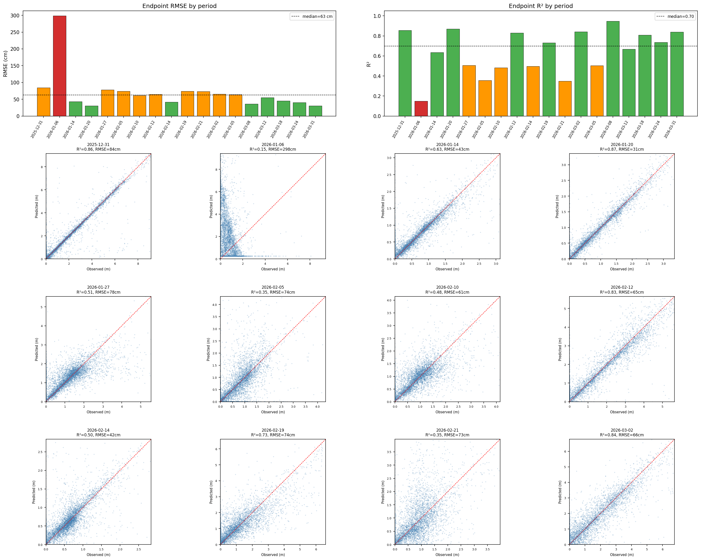
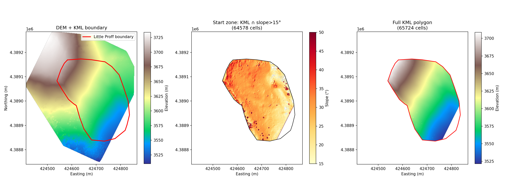
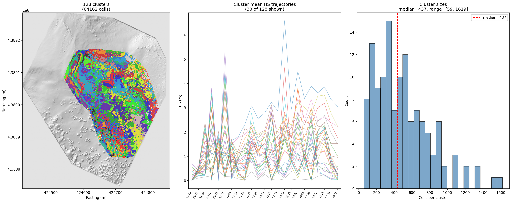

# Distributed SNOWPACK Forcing Generator

Generate spatially distributed hourly snow height (HS) forcing for SNOWPACK from periodic UAS snow depth surveys, a bare ground DEM, and hourly station weather data.

## Overview

The core problem: SNOWPACK needs hourly HS at every grid cell, but UAS surveys provide snapshots every 3–14 days. This pipeline fills the temporal gaps by decomposing the observed snow depth change at each cell into two components — **background accumulation** (tracked by a sheltered reference station) and **wind transport** (the spatial departure from the station) — and then distributing the transport to hourly timesteps proportional to wind energy.

The pipeline operates on the A-Basin "Little Professor" avalanche path, using a KML boundary polygon and slope threshold to define the analysis domain, and clusters cells with similar seasonal HS evolution to compress ~65K grid cells into ~130 representative SMET forcing files.

## Setup

```bash
pip install -r requirements.txt
```

## Directory Structure

```
project/
├── batch_process.py        # Main pipeline script (7 steps)
├── spatial_model.py         # Sx, terrain features, transport, gap-filling
├── smet_writer.py           # Unit conversions + SMET file generation
├── clustering.py            # Domain masking, cell clustering
├── config.py                # Project configuration (edit paths here)
├── requirements.txt
├── TRANSPORT_MODELS.md      # Future physics-based transport integration plan
├── docs/                    # Example output images
│
├── data/
│   ├── dem/
│   │   └── 251126_Professor_PTC_DSM.tiff       # Bare ground DEM (5 cm)
│   ├── surveys/
│   │   ├── 251231_Professor_PTC_snowHeight.tif  # Snow height GeoTIFFs
│   │   ├── 260106_Professor_PTC_snowHeight.tif
│   │   └── ...  (22 survey files, Nov 2025 – Mar 2026)
│   ├── weather/
│   │   └── weather_data.csv                     # Hourly station data
│   └── boundaries/
│       └── Little_Proff.kml                     # Start zone boundary
│
└── outputs/                  # Created automatically
    ├── resampled_1m/         # 1m DEM + survey .npy files
    ├── analysis/             # Transport, Sx, model, CV results, plots
    │   ├── gap_fill_validation.png
    │   ├── cluster_map.png
    │   ├── cluster_map.tif   # GeoTIFF of cluster assignments
    │   ├── domain_mask.npy
    │   └── ...
    ├── hourly_grids/         # Hourly HS grids (.npz per inter-survey period)
    └── smet/                 # Per-cluster SMET forcing files
```

## Usage

Run the full pipeline:
```bash
python batch_process.py all --no-model
```

Or run individual steps:
```bash
python batch_process.py resample    # 1. Resample surveys to 1m grid
python batch_process.py transport   # 2. Compute transport fields
python batch_process.py features    # 3. Compute Sx + terrain features
python batch_process.py train       # 4. Train RF model + LOO cross-validation
python batch_process.py gap_fill    # 5. Generate hourly HS grids
python batch_process.py cluster     # 6. Build domain mask, cluster cells
python batch_process.py smet        # 7. Write per-cluster SMET files
python batch_process.py all         # Run steps 1–7
python batch_process.py validate    # Run step 4 only (LOO-CV)
```

Each step caches its outputs, so re-running skips completed work. Delete `outputs/` for a clean run.

### Options

```bash
# Use smoothed observed transport instead of RF model (recommended)
python batch_process.py gap_fill --no-model

# Run from a different project directory
python batch_process.py all --project-dir /path/to/project
```

## How It Works

### Step 1: Resample

Resamples all survey GeoTIFFs (5 cm native) to a 1m reference grid aligned with the DEM using mean aggregation. Negative HS values (trees, rocks) are clipped to 0.

### Step 2: Transport Field Computation

For each consecutive survey pair, computes the **absolute transport field**:

```
transport(cell) = cell_ΔHS - station_ΔHS
```

where `station_ΔHS` is the snow depth change at the sheltered A-Basin SA-Base station (`CAABM`). This isolates the spatially variable wind-driven component from the background signal (accumulation + settlement) that the station tracks.

Positive transport = cell gained more than the station (wind deposition).
Negative transport = cell gained less (wind erosion or differential settlement).

The transport field is spatially smoothed (15m window) to reduce survey noise while preserving the 10–50m scale deposition patterns.

### Step 3: Terrain Features

For each survey date, computes:
- **Winstral Sx** from the snow surface DEM (bare ground + HS) for 16 wind directions at 22.5° spacing, with a 300m upwind search distance
- **Wind-weighted Sx**: directional Sx values weighted by the period's wind energy (speed² × frequency) from each direction
- **Terrain features**: slope, aspect (sin/cos), plan curvature, profile curvature, elevation



### Step 4: Random Forest Training (Optional)

Trains a Random Forest regressor to predict the transport field from terrain features + wind statistics. Uses leave-one-out cross-validation across all inter-survey periods.

**Current status**: The RF achieves mean R² of ~0.10 in LOO-CV (median r = 0.22). The terrain-transport relationship is unstable across periods because wind direction changes flip the spatial pattern — a cell sheltered under W wind is exposed under N wind, and Sx collapses this directional information into a single number. The smoothed observed transport (`--no-model`) significantly outperforms the RF.

**Path forward**: Replace Sx with WindNinja distributed wind fields (see `TRANSPORT_MODELS.md`).

### Step 5: Gap-Fill (Hourly HS Generation)

The core interpolation step. For each inter-survey period:

1. **Background**: every cell receives the station's hourly ΔHS (accumulation, settlement, melt tracked uniformly)
2. **Transport**: the observed transport field is distributed across hours proportional to wind speed²:

```
hourly_transport(cell, t) = transport(cell) × ws²(t) / Σws²
```

3. **Accumulation**: hourly HS = previous HS + background ΔHS + hourly transport, clamped to ≥ 0

This ensures:
- Transport only occurs during windy hours (calm hours → cells just track the station)
- Total transport over the period sums to the observed survey-to-survey departure
- The spatial pattern at survey endpoints approximately matches observations

**Validation** (18 periods with weather data, `--no-model`):

| Metric | Median | Range |
|--------|--------|-------|
| Endpoint RMSE | ~58 cm | 31 – 298 cm |
| Endpoint R² | ~0.74 | 0.15 – 0.95 |
| Endpoint r | ~0.86 | -0.39 – 0.97 |

The Dec 31 period (RMSE=298cm) is an outlier likely caused by a survey reference surface issue.



### Step 6: Cluster

Builds the analysis domain mask and clusters cells for SMET compression.

**Domain mask** = KML boundary polygon ∩ slope ≥ 15° ∩ valid DEM. The KML file defines the avalanche path boundary (Little Professor), reducing the domain from 146K to ~65K cells.



**Cell clustering** groups cells with similar HS evolution across all survey times:
1. Build an (n_cells × n_surveys) HS matrix
2. PCA dimensionality reduction (18 surveys → ~6 components)
3. MiniBatch K-means clustering (target ~500 cells/cluster)
4. Save cluster map as GeoTIFF + numpy array

Cells in the same cluster experience similar accumulation, wind loading, and melt patterns throughout the season. Each cluster gets one representative HS time series (mean of its members).

Compression: ~65K cells → ~130 clusters (~500x reduction).



### Step 7: SMET Output

Loads the saved cluster map and hourly grids, computes the mean HS time series for each cluster, and writes one SMET file per cluster. Each SMET file contains the full hourly forcing (TA, RH, VW, DW, ISWR, ILWR, HS) with proper MeteoIO units and coordinate metadata.

Output: ~130 SMET files totaling ~20 MB for a full season.

## Configuration

Edit `config.py` to change:

| Parameter | Default | Description |
|-----------|---------|-------------|
| `boundary_kml` | `data/boundaries/Little_Proff.kml` | Start zone boundary |
| `min_slope_deg` | 15.0 | Minimum slope for domain mask |
| `flight_hour_utc` | 18 | Survey flight time (11 AM MST) |
| `target_cells_per_cluster` | 500 | Controls cluster count |
| `n_clusters_override` | None | Force specific cluster count |
| `sx_search_distance_m` | 300.0 | Sx upwind search radius |
| `transport_smoothing_window_m` | 15 | Spatial smoothing (meters) |

### Station Data Units (CAIC Raw Sensor Values)

| Parameter | Column | Raw unit | Conversion |
|-----------|--------|----------|------------|
| Temperature | `temp` | tenths of °F | /10, to °C |
| Dew point | `dewp` | tenths of °F | /10, to °C |
| Wind speed | `wspd` | tenths of mph | /10, to m/s |
| Wind gust | `gust` | tenths of mph | /10, to m/s |
| ISWR | `swin` | tenths of W/m² | /10 |
| Snow depth | `depth` | tenths of inches | /10, to cm |
| RH | `rh` | percent | direct |
| Wind direction | `wdir` | degrees | direct |

### ILWR Parameterization

Incoming longwave radiation is estimated from TA, RH, and ISWR using Brutsaert (1975) clear-sky emissivity with a cloud correction derived from the ISWR clearness index. This produces reasonable values (146–240 W/m² range) for high-altitude sites, but should be replaced with NWP ILWR when available.

## Known Issues and Limitations

**Dec 31 survey**: RMSE=298cm, r=-0.39. The station gained +24 cm but the grid median dropped 63 cm. Likely a reference surface or registration issue. Currently included in the pipeline but contaminates any period touching it.

**RF model performance**: Mean LOO-CV r=0.10. The terrain-transport relationship isn't stable across wind regimes because Sx collapses directional information. Use `--no-model` until WindNinja wind fields are integrated.

**Endpoint matching**: Gap-filled HS at survey times doesn't exactly match observations due to spatial smoothing of the transport field and non-negative HS clipping. Could add endpoint correction but risk creating last-timestep artifacts.

**Timestamps**: All internal processing uses UTC. The SQL database stores in UTC (verified from ISWR diurnal pattern). SMET files use `tz=0`.

## Future Work

See `TRANSPORT_MODELS.md` for the physics-based transport integration plan. Priority order:

1. **WindNinja wind field library** — replace Sx with distributed wind speeds (highest impact)
2. **Transport threshold from snow age** — use HN24 to estimate erodibility decay
3. **Sublimation parameterization** — Pomeroy & Li (2000) mass budget correction
4. **FSM2oshd / Quéno et al. (2024)** — intermediate-complexity transport model
5. **Kalman smoother** — use surveys as analysis updates to transport model forecast