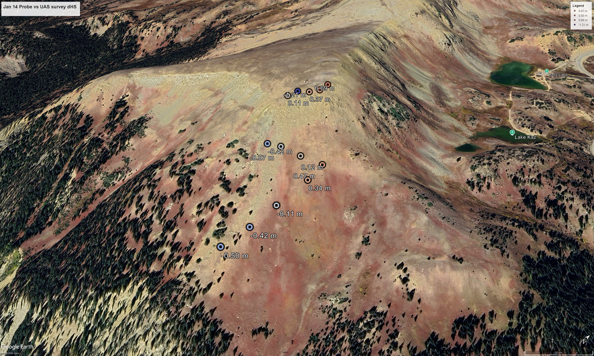

# Jan 14 2026 Probe Validation — Summary

## What we observed

On 14 Jan 2026, Rayan Zarter collected 13 manual probe HS measurements across the Little Professor path. We compared these measurments against the Jan 14 UAS-derived HS grid. We run the comparison was run at two resolutions: at the pixel under each probe, and against the mean HS of the pipeline cluster that contains the probe.

Figure 1: *An overview of the Jan 14, 2026 probing locations and the relative HS measurments compare to the UAV HS survey from the same day.*

Table 1: Probing vs survey statistics
| Comparison | Mean bias (m) | SD (m) | RMSE (m) | OLS slope | R² |
| --- | ---: | ---: | ---: | ---: | ---: |
| Probe vs. UAS pixel | −0.002 | 0.519 | 0.499 | 0.566 | 0.594 |
| Probe vs. UAS cluster mean | +0.084 | 0.309 | 0.308 | 0.928 | 0.737 |

The pixel-scale comparison initially appeared to show a slope-<1 bias (UAS over-spreading the depth distribution relative to probes). Aggregation to cluster resolution removes most of that effect: the slope moves to 0.93, the RMSE drops by ~38%, and the mean residual remains statistically indistinguishable from zero (SE ≈ 0.086 m, t ≈ 0.98, n = 13). The pixel-scale slope effect is therefore consistent with sub-meter spatial variability combined with the integer-meter GPS precision of the probe locations, not a true UAS bias.

Two residual patterns survive the cluster aggregation. First, the two southernmost probes (points 1 and 2, lower runout / apron) retain positive residuals of +0.31 and +0.39 m at the cluster level. The pattern, large positive disagreement persisting after spatial aggregation, is the signature expected if the November 26 bare-ground DEM contains low vegetation that is being differenced out as if it were ground. Second, three probes in the upper fetch area (points 10, 12, 13) show probe-versus-cluster-mean disagreements of 40–60 cm, which exceed the cluster stopping criterion (`max_cluster_std_m = 0.10 m`) by 4–6×. This indicates either positional error placing the probes in adjacent clusters, true sub-cluster microsite variability in the cornice/scour zone, or that the stopping criterion is not being strictly enforced for those clusters.

## Implications for SNOWPACK and the downstream chain

For the SNOWPACK forcing itself, the Jan 14 distributed HS grid does not require correction at the resolution the pipeline operates on. The cluster-mean HS is consistent with probes within noise, so SNOWPACK runs over the existing clusters carry no detectable Jan 14-specific bias.

The bare-ground DEM contamination at points 1–2 is more consequential because it is not a Jan 14 issue — it is a structural issue that propagates to every survey and every modeled day. If vegetation tops are being treated as ground in the lower runout, the differenced HS there is biased low at all times. Downstream, this depresses the modeled snow load over weak layers in the runout zone, which feeds into both the SNOWPACK-derived stability indices for cells in that area and the eventual com1DFA entrainment depth in any release-runout scenario that reaches the apron. The magnitude suggested by points 1 and 2 (~0.3–0.4 m) is large enough to matter for both purposes.

The fetch-area cluster behavior is consequential for the probabilistic release boundary model rather than for SNOWPACK directly. The logistic regression boundary model treats cluster pairs as transitions between approximately homogeneous units, with within-cluster variability assumed small relative to between-cluster gradients. If the 10 cm SD constraint is not actually being met in the upper fetch, then transitions in that area are between units that are internally less homogeneous than the model assumes, which would inflate noise in the fitted `delta_*` coefficients and is a candidate explanation for some of the collinearity behavior already flagged in `delta_lambda_rel`.

## What we are doing now, and why

No correction is being applied to the Jan 14 HS grid. The cluster-level mean residual is not statistically distinguishable from zero with n = 13, and removing the two south-end points (which represent a separate identifiable phenomenon) reduces the apparent bias to +0.036 m. Applying any offset based on this dataset alone would be fitting noise and would propagate as a fake systematic adjustment into every subsequent survey if extrapolated.

The cluster-scale RMSE of 0.31 m is being adopted as the working uncertainty estimate for cluster-mean HS, to be carried into the probabilistic release model. This is more defensible than a correction because it feeds an existing piece of the model (the gradient arrest criteria already implicitly assume some HS noise) rather than introducing a new transformation.

The bare-ground DEM is being audited at and near points 1 and 2 against November 2025 imagery and raw point cloud data. If vegetation is confirmed, the fix is masking or DEM patching in the south runout area, applied uniformly to all surveys rather than as a per-survey correction. This is treated as the highest-leverage action arising from this exercise because of its effect across all dates.

The within-cluster HS statistics for the clusters containing points 10, 12, and 13 are being checked against the 10 cm stopping criterion to determine whether the criterion is being enforced or whether those clusters were modified post-clustering (e.g., by gap fill). This is diagnostic and may or may not require code changes depending on what it shows.
