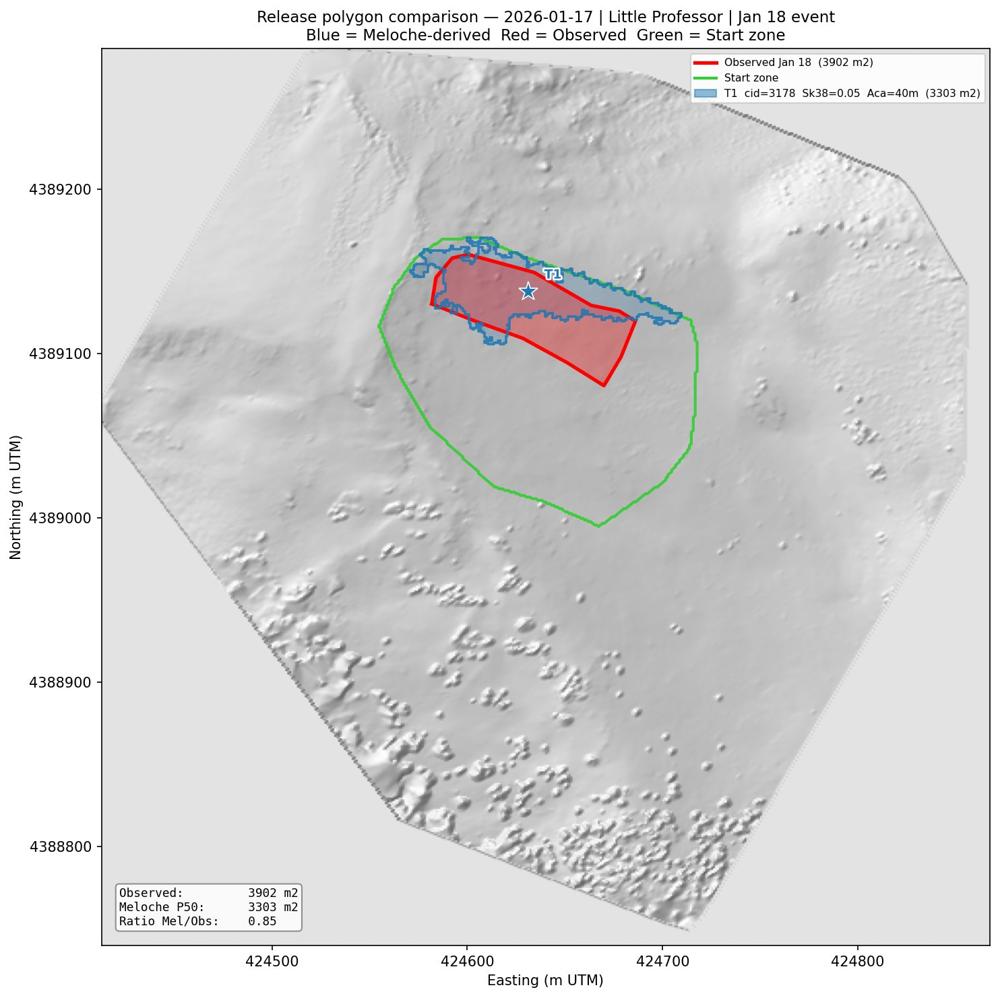
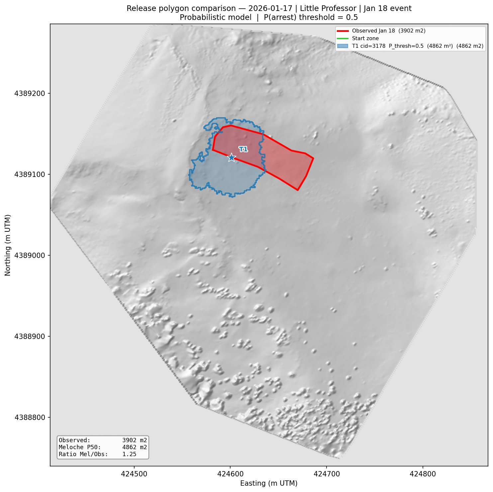
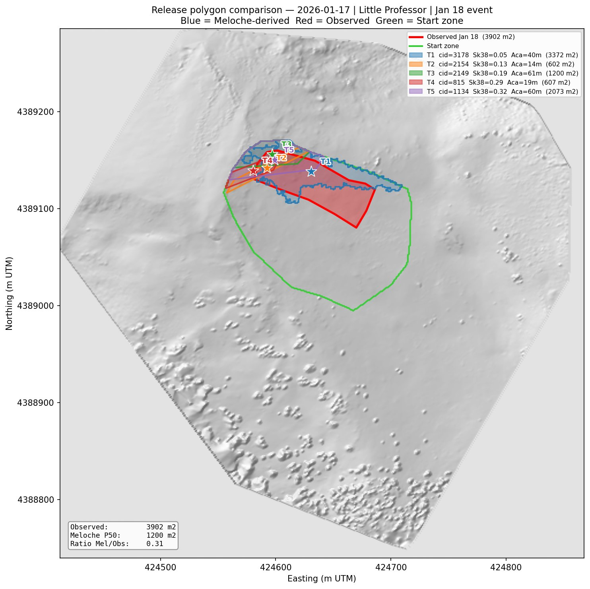

# Avalanche Event Handling

**Project:** Little Professor Avalanche Path, Loveland Pass (US-6), Colorado  
**Key modules:** `avalanche.py`, `reinitialize_snowpack.py`  
**Pipeline step:** `step_avalanche` and `step_reinit` in `forcing_pipeline.py`  
**Last updated:** 2026-04-30

---

## 1. Overview

Avalanche events create two problems for the pipeline:

**Survey-to-survey contamination.** The HS change (dHS) between consecutive UAS surveys conflates wind transport with mass redistribution from avalanches. If an avalanche occurred between two survey dates, the dHS field contains both the wind-driven spatial transport pattern (which the gap-fill model needs) and the avalanche erosion/deposition signal (which contaminates it). These must be separated before gap-filling.

**SNOWPACK continuity.** After an avalanche, the release zone has a fundamentally different snowpack — the slab above the failure plane is gone. If SNOWPACK continues simulating as if the slab is still there, all subsequent output (stability indices, Meloche parameters, scenario generation) is wrong for the affected clusters. The simulation must be reinitialized with the post-event snowpack state.

This document covers the detection methods, the reinitialization workflow, and how to run the pipeline when avalanche events are present.


January 18, 2026 skier-triggered D2 slab avalanche on the Little Professor path, viewed from Loveland Ski Area. The release area is visible in the upper start zone, with the track running through sparse timber and the deposit terminating above US Highway 6.

---

## 2. Avalanche Boundary Detection

Two detection methods are implemented in `avalanche.py`. Both operate on the dHS anomaly field (cell dHS minus station dHS) between consecutive UAS surveys.

### 2.1 Min-kernel method (default)

The min-kernel approach uses morphological filters to identify areas of consistent snow erosion. It is the default method (`--method minkernel`) and has three tunable parameters.

**How it works:**

The dHS anomaly is pre-smoothed (3×3 uniform filter to reduce single-pixel noise), then a minimum filter (`scipy.ndimage.minimum_filter`) replaces each cell with the minimum value in its kernel-sized neighborhood. In an avalanche release zone where all neighbors are losing snow, the min filter preserves the negative signal. Isolated negative pixels (a tree shadow, a rock) surrounded by positive or neutral neighbors get their filtered value diluted — the min of a mixed neighborhood is less extreme than the min of a uniformly eroding neighborhood.

After filtering, cells below a threshold (mean − σ × threshold_sigma) on terrain steeper than `min_slope_deg` are marked as release candidates. Morphological cleanup (fill holes, erode/dilate) removes fragments, and connected components with area ≥ `min_area_m2` are retained.

Deposit detection uses the symmetric max filter on flatter terrain.

**Parameters:**

| Parameter | Default | Description |
|-----------|---------|-------------|
| `kernel_size` | 7 | Min/max filter window (pixels). Larger = more smoothing, bridges bigger gaps |
| `threshold_sigma` | 1.2 | Std devs below mean for release threshold |
| `min_area_m2` | 200 | Minimum region area to retain |

**Calibration:** Tested on the Jan 14→20 survey pair (bracketing the Jan 18 D2 event). At `kernel_size=7, threshold_sigma=1.2`: release area = 3,531 m² (observed: 3,902 m², ratio 0.90), IoU with observed release polygon = 0.55–0.64.

### 2.2 Canny + watershed method (legacy)

The original detection method using Canny edge detection to find crown boundaries, then watershed segmentation to grow release/deposit regions from seed points. Has 8+ tunable parameters (`canny_sigma`, `canny_low`, `canny_high`, `erosion_threshold_sigma`, `deposit_threshold_sigma`, `min_area_m2`, `morph_radius`, `dem_roughness_threshold`). Available via `--method canny`.

On the Jan 18 event: release area = 728 m² (ratio 0.19), IoU = 0.121. Consistently undersized and fragmented compared to the min-kernel approach.

### 2.3 Comparison


Side-by-side comparison of min-kernel (left) and Canny+watershed (center) detection on the Jan 14→20 period. Right panel shows the dHS anomaly field with both boundaries overlaid (red = min-kernel, cyan = Canny+watershed, green = observed release polygon).

The min-kernel method captures the full release area as a single contiguous region, while the Canny+watershed method detects only a small fragment. The min-kernel deposit zone is over-detected (includes wind-loaded areas outside the avalanche path) — this is a known limitation and does not affect the reinitialization workflow, which uses only the release mask.

| Metric | Min-kernel | Canny+watershed |
|--------|-----------|----------------|
| Release area | 3,531 m² | 728 m² |
| Ratio to observed | 0.90 | 0.19 |
| IoU | 0.55–0.64 | 0.12 |
| Tunable parameters | 3 | 8+ |
| Regions detected | 1 | fragmented |

---

## 3. Running Detection

```bash
# Min-kernel (default) — recommended
python src/snowpack-model-feeder/avalanche.py \
    --date-before 2026-01-14 --date-after 2026-01-20

# Adjust sensitivity
python src/snowpack-model-feeder/avalanche.py \
    --date-before 2026-01-14 --date-after 2026-01-20 \
    --kernel-size 7 --threshold-sigma-mk 1.0

# Canny+watershed (legacy)
python src/snowpack-model-feeder/avalanche.py \
    --date-before 2026-01-14 --date-after 2026-01-20 --method canny

# Or via the pipeline
python src/snowpack-model-feeder/forcing_pipeline.py avalanche
```

The `step_avalanche` pipeline step runs detection on all consecutive survey pairs, identifies events, and saves the results for use by the transport correction and gap-fill steps.

---

## 4. Post-Avalanche SNOWPACK Reinitialization

### 4.1 Concept

After an avalanche is detected, the release zone clusters need their SNOWPACK simulations corrected. The slab above the weak layer has been removed — SNOWPACK must reflect this.

The reinitialization reads each affected cluster's `.sno` restart file and removes snow layers from the top down until the cumulative removed thickness equals the slab depth above the failure plane. The remaining layers (weak layer, depth hoar, old snow) retain their properties. SNOWPACK then restarts from the event timestamp with the truncated profile.

### 4.2 Scour depth

For each release cluster, the scour depth is determined from `slab_thickness` in `snap_features` — the depth from the snow surface to the WL/slab interface identified by `split_wl_slab()` in `snowpack_analysis.py`. This is the physically correct value: the mass that actually released is the slab above the basal failure plane.

If `slab_thickness` is unavailable for a cluster (e.g., no WL detected), the fallback is 80% of total HS.

### 4.3 .sno file modification

The SNOWPACK `.sno` restart file stores the full layer stratigraphy in SMET format. Layers are listed bottom to top, with `Layer_Thick` as the thickness of each layer. The scour procedure:

1. Read the `.sno` file (SMET header + layer data)
2. Remove layers from the top (end of list) until cumulative removed thickness ≥ scour depth
3. If the scour depth falls within a layer, trim that layer's thickness
4. Update header fields: `nSnowLayerData`, `HS_Last`, `ProfileDate`, `ErosionLevel`
5. Write the modified `.sno` with a `.bak` backup of the original

### 4.4 What is NOT reinitialized

The current implementation only handles the **release zone**. Track and deposit zones are left unchanged:

- **Track zone** — partial scour by the flowing avalanche. Would require an erosion depth model (not implemented).
- **Deposit zone** — debris accumulation. Would require adding mass to `.sno` files with assumed density and grain properties (not implemented).

For operational purposes, the release zone is the critical correction. Track and deposit clusters are typically outside the start zone and don't affect subsequent release geometry predictions.

---

## 5. Running Reinitialization

### 5.1 Two-pass SNOWPACK workflow

```
Pass 1:  Season start → event date        (already completed)
Reinit:  Scour release cluster .sno files  (this step)
Pass 2:  Event date → end of season        (rerun SNOWPACK)
```

### 5.2 Commands

```bash
# Step 1: Dry run — see what would be modified
python src/snowpack-model-feeder/forcing_pipeline.py reinit \
    --event-date 2026-01-18 \
    --date-before 2026-01-14 --date-after 2026-01-20 \
    --snapshot-date 2026-01-17 \
    --reinit-dry-run

# Step 2: Scour for real
python src/snowpack-model-feeder/forcing_pipeline.py reinit \
    --event-date 2026-01-18 \
    --date-before 2026-01-14 --date-after 2026-01-20 \
    --snapshot-date 2026-01-17

# Step 3: Rerun SNOWPACK from event date
bash snowpack/little_prof/run_snowpack.sh 2026-01-18T00:00
```

### 5.3 Using a pre-drawn release boundary

If the auto-detected boundary is unsatisfactory, use a hand-drawn GeoJSON:

```bash
python src/snowpack-model-feeder/forcing_pipeline.py reinit \
    --event-date 2026-01-18 \
    --release-geojson data/boundaries/avalanche_release_area.geojson
```

### 5.4 Standalone usage

The reinitialization can also be run directly:

```bash
python src/snowpack-model-feeder/reinitialize_snowpack.py \
    --event-date 2026-01-18 \
    --date-before 2026-01-14 --date-after 2026-01-20 \
    --snapshot-date 2026-01-17 --dry-run
```

---

## 6. Transport Correction

When an avalanche occurs between surveys, the dHS field conflates wind transport with avalanche mass redistribution. The `step_avalanche` pipeline step separates these by:

1. Detecting avalanche boundaries (release + deposit masks)
2. Within the release mask: setting the transport field to zero (the snow loss is from the avalanche, not wind)
3. Within the deposit mask: setting the transport field to zero (the snow gain is debris, not wind deposition)
4. Outside both masks: the transport field represents genuine wind-driven redistribution

This corrected transport field is what `step_gap_fill` uses to generate hourly HS grids. Without this correction, the gap-fill model would interpret the avalanche erosion as extreme wind scour and produce unrealistic HS patterns for the inter-survey period.

---

## 7. Integration with Release Geometry

The avalanche detection directly feeds into the release geometry pipeline:

**Trigger selection** (`step_scenarios`): After reinitialization, the release zone clusters have reduced HS and different stability indices. For subsequent forecast dates, these clusters are correctly excluded as trigger candidates (their slab is gone).

**BFS propagation**: The reinitialized snowpack produces different Meloche parameters (Λ, τ_g, A_ca) for post-event dates, reflecting the actual snowpack state rather than a phantom slab.

**Probabilistic boundary model** (`fit_boundary_model.py`): Detected avalanche events provide training data — the release boundary cluster pairs are labeled as boundary (arrest=1) or interior (arrest=0) transitions.

---

## 8. Validation — January 18, 2026

### 8.1 Release area comparison



Physics BFS model (blue) vs observed release area (red). The BFS polygon (3,303 m² with the original DEM, 4,664 m² with the updated DEM) brackets the observed area (3,902 m²). The trigger (cid=3178, Sk38=0.05) is correctly placed in the upper-left quadrant.

### 8.2 Probabilistic model comparison



Probabilistic model (blue, P(arrest) threshold=0.5) produces a 4,862 m² polygon — 25% overestimate. The boundary placement reflects primary reliance on δτ_p gradients. The model captures the right flank (strong τ_p gradient) but does not arrest as sharply on the left.

### 8.3 Distributed Meloche fields


Six-panel view of distributed slab and WL properties at the cluster scale, Jan 17 (day before event). Red = observed release area, green = start zone. Key features: Λ gradient across the release area, τ_g peaking at 600–700 Pa in the core, burial depth thinning at the right flank where non-triggering ski tracks were observed.

### 8.4 Multi-trigger ensemble



Five-trigger ensemble showing that all trigger candidates land inside or adjacent to the observed release area. The physical filters (τ_g, slope, Sk38, elevation) successfully exclude the adjacent slope where skiers were present without triggering.

### 8.5 Crack propagation animation


BFS propagation from trigger cid=3178. Cells colored by arrest reason: teal = thickness discontinuity, red = stauchwall, purple = Λ discontinuity, orange = distance cap, gray = outside start zone.

---

## 9. Known Limitations

1. **Deposit detection over-coverage.** The min-kernel max filter flags wind-loaded areas as deposit. A spatial proximity filter (require deposits to be downslope and connected to a release zone) would improve this.

2. **Track zone not reinitialized.** Partial scour in the avalanche track is not modeled. Track clusters retain their pre-event snowpack.

3. **Single-event calibration.** Min-kernel parameters (kernel_size=7, threshold_sigma=1.2) are calibrated on one event. Generalization to different avalanche sizes, aspects, and snowpack conditions requires testing on additional events.

4. **Survey timing dependency.** Detection quality depends on the pre/post-event surveys bracketing the event closely. If significant snowfall occurs between the event and the post-event survey, the dHS signal is diluted.

5. **Temporal precision.** The event timestamp in the `.sno` file is set to the reported event time, but the actual layer state is from the end of the SNOWPACK simulation (which may be days later). The two-pass approach (run to event date, scour, rerun) avoids this by using the layer state at the correct timestamp.

