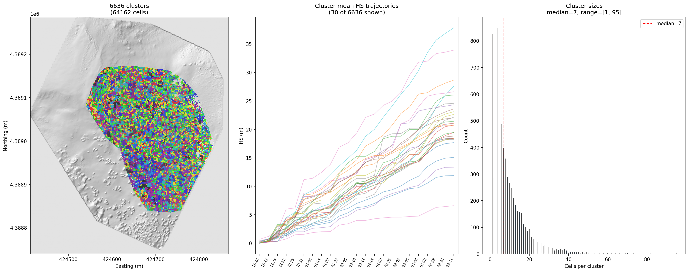
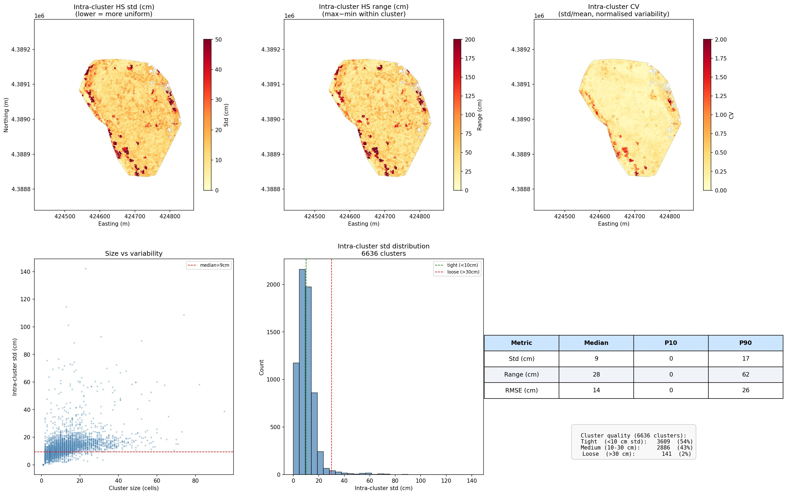
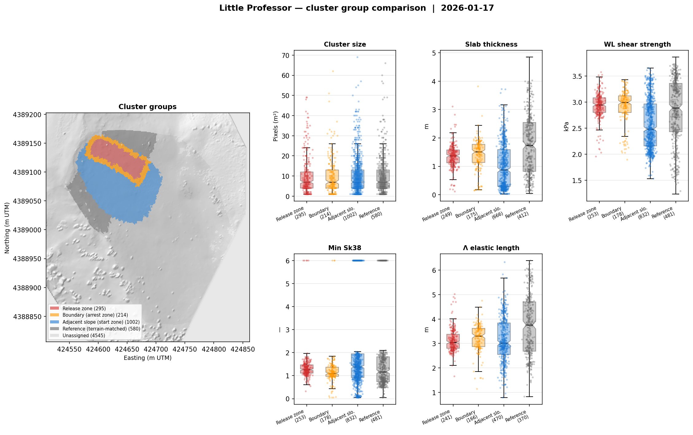

# Clustering Methods: Spatial Compression for Distributed SNOWPACK

**Project:** Little Professor Avalanche Path, Loveland Pass (US-6), Colorado  
**Pipeline step:** `step_cluster` in `pipeline.py` (initial); `cluster_update` in `analysis_pipeline.py` (mid-season)  
**Key modules:** `clustering.py`, `cluster_update.py`  
**Last updated:** 2026-09-02

---

## 1. Motivation

The UAS-derived snow depth domain at Little Professor contains ~65,000 active cells at 1 m resolution after KML boundary clipping and slope filtering. Running SNOWPACK independently at every cell is computationally prohibitive — each simulation requires hourly forcing over the full season (~3,000 timesteps), producing a layered stratigraphy profile. At 65,000 locations this would require ~195 million layer-timestep evaluations per season and generate terabytes of output.

The clustering step compresses the spatial domain by grouping cells with similar snow depth evolution into clusters, each represented by a single SNOWPACK simulation. This reduces the problem from ~65,000 simulations to ~6,600 while preserving the spatial variability that drives the release geometry model. The compression ratio (~10:1) makes the full distributed SNOWPACK run feasible on a single compute node in under 24 hours.

The key constraint is that the clustering must preserve spatial heterogeneity at the scale relevant to crack arrest — the BFS propagation model (§4 of `release_area_geometry.md`) evaluates slab property gradients between neighboring clusters, so clusters must be small enough that inter-cluster variability captures the real spatial gradients in slab thickness, density, and weak layer properties.

---

## 2. Domain Masking

Before clustering, the analysis domain is defined by the intersection of three constraints:

**KML boundary** (`Little_Proff.kml`): the UAS survey footprint polygon, reprojected from WGS84 to UTM via pyproj. Excludes terrain outside the survey coverage.

**Slope threshold** (≥15°): excludes flat terrain where avalanche release is not physically plausible. Slope is computed from the DEM gradient at 1 m resolution.

**Valid DEM cells**: excludes NaN pixels (gaps in the photogrammetric reconstruction, typically rocks and trees).

```
Domain: 146,256 valid cells → 64,578 after KML clip and slope filter
```

The domain mask is saved and reused by all downstream steps (gap-fill, SMET writing, scenario generation).

---

## 3. HS Evolution Matrix

The clustering input is a matrix of snow height (HS) values at each survey date for every cell in the domain:

```
HS matrix: (n_cells × n_surveys) = (64,162 × 23)
```

Each row is one cell's HS trajectory across 23 UAS surveys spanning the season. Cells with NaN in any survey are dropped (416 cells, typically at domain edges where individual surveys had incomplete coverage).

This matrix captures how each cell's snow depth evolves over time — cells that accumulate and lose snow similarly (same wind exposure, same aspect, same elevation band) will have similar row vectors. Cells with different wind loading, aspect-driven redistribution, or proximity to terrain features (ridges, gullies) will diverge.

---

## 4. Clustering Algorithm

### 4.1 PCA dimensionality reduction

The 23-survey HS matrix is first reduced via PCA, retaining components explaining 99% of variance. For this domain, PCA reduces the feature space while preserving the dominant modes of spatial variability (elevation gradient, wind redistribution, aspect effects).

```
PCA: components explain 99.1% of variance
```

### 4.2 Initial K-means

MiniBatchKMeans is applied in PCA space with an initial target of ~1,283 clusters (determined by `auto_select_n_clusters()` targeting ~50 cells per cluster). This provides a coarse partition that is then refined.

```
Initial K-means: 1,283 clusters from 64,162 cells
```

### 4.3 Recursive splitting

Clusters exceeding `max_cells_per_cluster` (20) are recursively bisected using MiniBatchKMeans(n_clusters=2) in PCA space. Splitting is skipped if the cluster's maximum per-survey standard deviation is below `max_cluster_std_m` (8 cm) — these clusters are already internally homogeneous despite their size, and forcing a split would create artificial boundaries.

Each split is checked for quality: both halves must contain at least `min_cluster_size` (4) cells. Degenerate splits (one half below minimum) are rejected, and the cluster is kept intact. Random seeds vary across iterations to avoid deterministic split failures.

```
After recursive splitting: 4,998 clusters (max size: 65, target max: 20)
Skipped 18 split(s) — cluster std < 8 cm
14 cluster(s) still exceed max size (kept because std < threshold or unsplittable)
```

The 14 oversized clusters are terrain features where HS is spatially uniform across 20+ pixels — typically flat benches or uniform slope facets where splitting would not improve representation.

### 4.4 Spatial contiguity enforcement

K-means clusters in PCA space are not necessarily spatially contiguous — two disconnected patches of terrain can have identical HS evolution. The contiguity enforcement step splits disconnected cluster regions into separate clusters using `scipy.ndimage.connected_components`. Small fragments (< `min_cluster_size`) are merged into their nearest spatial neighbor by Euclidean distance.

```
After contiguity enforcement: 6,636 clusters
```

This increases the cluster count from 4,998 to 6,636 because many PCA-space clusters span non-contiguous terrain patches that are physically separate.

---

## 5. Mid-Season Cluster Splitting

Initial clustering is performed once per season before the first SNOWPACK run (§4). As additional UAV surveys land through the season, the cumulative HS trajectory for some clusters may reveal internal heterogeneity that was not apparent from the early-season surveys. The `cluster_update` step (in `analysis_pipeline.py`) checks for this and splits clusters that have grown too heterogeneous.

### 5.1 When to run

Run `cluster_update` after each new UAV survey is incorporated into the resampled grid stack. It is not part of the daily forecast chain — only a new survey changes the cumulative HS matrix used for quality assessment.

### 5.2 Adaptive split threshold

The heterogeneity criterion uses the **maximum per-survey HS standard deviation** across all surveys, compared against an **adaptive threshold** that scales with snow depth:

```
threshold = clip(rel_frac × median_hs, min_abs, max_abs)
          = clip(0.10 × median_hs, 0.03 m, 0.12 m)
```

The adaptive formulation accounts for the non-linear relationship between HS variability and snowpack stratigraphic similarity:

| Season phase | Median HS | Threshold |
|---|---|---|
| Early season / shallow | 0.30 m | 0.03 m (min clamp) |
| Mid-season | 0.80 m | 0.08 m |
| Deep snowpack | 1.20+ m | 0.12 m (max clamp) |

A shallow HS difference of 3 cm means the entire snowpack is different; the same difference at 1.2 m depth mainly affects the recent upper layers. The max clamp prevents the threshold from growing indefinitely — spatial gradients in the upper snowpack remain relevant for weak layer burial depth regardless of total depth.

### 5.3 Split algorithm

Clusters flagged as heterogeneous (`max_std > threshold`) are bisected using MiniBatchKMeans(k=2) on PCA-reduced HS features, the same approach used in recursive splitting (§4.3). Both children must contain at least `min_cluster_size` cells; degenerate splits are rejected.

**Inheritance rule:** the larger child (by pixel count) inherits the parent cluster ID. This means the parent's SNOWPACK simulation history remains valid for most of the original cells without a rerun. Only the minority child gets a new ID and needs SNOWPACK to run from its split date.

Contiguity is **not** re-enforced after mid-season splits to preserve existing cluster IDs. The initial `step_cluster` run already ensures contiguity; a mid-season split may create a spatially disconnected minority child (two patches with similar seasonal HS but separated by different terrain), which is acceptable since SNOWPACK operates on per-cluster representative HS series, not on spatial adjacency.

### 5.4 Initializing child SNOWPACK simulations

For each new child cluster, `cluster_update` produces:

**Child SMET**: the parent SMET's met forcing columns (TA, RH, VW, DW, ISWR, ILWR) are kept unchanged — meteorological forcing is terrain-independent at the cluster scale and identical to the parent. The HS column is replaced with the mean HS series of the child pixels from the hourly grid stack.

**Child .sno**: the parent's restart `.sno` (output from the most recent SNOWPACK run) is copied to the child's input `.sno`. This gives the child a warm start from the parent's stratigraphy at the split date. Because SNOWPACK is deterministic — identical SMET inputs produce identical output — the child's future stratigraphy will diverge from the parent's only in proportion to the divergence in their HS series.

After `cluster_update`, run SNOWPACK for the new child cluster IDs only using the `CLUSTERS_FILE` mechanism in `run_snowpack.sh`. The parent cluster's SNOWPACK simulation continues unchanged on the next daily run.

### 5.5 Audit log

Each split is recorded in `outputs/analysis/cluster_splits.json`:

```json
{
  "parent_cid": 42,
  "child_cid": 6637,
  "parent_n_cells": 18,
  "child_n_cells": 6,
  "max_std": 0.094,
  "threshold": 0.071,
  "timestamp": "2026-01-15T14:32:00"
}
```

---

## 6. Cluster Quality

### 6.1 Size distribution



Left: spatial distribution of 6,636 clusters (64,162 cells) colored by cluster ID, overlaid on DEM hillshade. Center: representative HS trajectories for 30 randomly sampled clusters showing the range of snow depth evolution across the domain. Right: cluster size histogram.

```
Cluster sizes: min=1, median=7, max=95 cells
```

At 1 m resolution, the median cluster diameter is ~3 m (√7 ≈ 2.6 m), which is well below the ~5–10 m scale at which slab property gradients drive crack arrest in the BFS model. The largest clusters (95 cells, ~10 m diameter) are internally homogeneous (std < 8 cm) and do not degrade the spatial resolution of the arrest criteria.

### 6.2 Intra-cluster variability



Top row: spatial maps of intra-cluster HS standard deviation, range, and coefficient of variation. Bottom row: size vs variability scatter plot and std histogram.

| Metric | Median | P10 | P90 |
|--------|--------|-----|-----|
| Std (cm) | 9 | 0 | 17 |
| Range (cm) | 28 | 0 | 62 |
| RMSE (cm) | 14 | 0 | 26 |

**Cluster quality classification:**

| Category | Criterion | Count | Fraction |
|----------|-----------|-------|----------|
| Tight | std < 10 cm | 3,609 | 54% |
| Medium | 10–30 cm | 2,886 | 43% |
| Loose | > 30 cm | 141 | 2% |

54% of clusters have internal HS variability below 10 cm — these cells are well-represented by a single SNOWPACK simulation. The 2% classified as "loose" (std > 30 cm) are typically at terrain transitions (ridge crests, gully edges) where sharp HS gradients cross cluster boundaries. These clusters contribute to the tails of the Meloche gradient features (Λ, h discontinuities) that drive crack arrest.

### 6.3 Group comparison



Left: clusters colored by group assignment (release, boundary, adjacent, reference). Right: notched boxplots comparing cluster size and snowpack properties across groups.

Cluster sizes are consistent across groups (median = 7 cells for all groups) because clustering is performed in PCA space on HS evolution, independent of group assignment. Groups are a post-hoc spatial label based on overlap with the observed release area — they do not influence cluster geometry.

The snowpack property panels show the physically meaningful group differences: the release zone has lower Sk38 (more unstable), slightly thicker slabs, and lower WL shear strength compared to adjacent and reference terrain. The boundary group (release clusters neighboring adjacent clusters and vice versa) shows intermediate properties — transitional slab characteristics at the arrest zone, consistent with the gradient arrest criteria used in the BFS model.

---

## 7. Parameters

**Initial clustering (`step_cluster`)**

| Parameter | Value | Description |
|-----------|-------|-------------|
| `target_cells_per_cluster` | 50 | Initial k-means target (before recursive splitting) |
| `max_cells_per_cluster` | 20 | Recursive splitting size threshold |
| `max_cluster_std_m` | 0.08 m | Skip recursive split if cluster std is below this |
| `n_pca_components` | 0.99 | PCA variance retention threshold |
| `min_cluster_size` | 4 | Minimum cells per cluster (reject degenerate splits) |
| `enforce_contiguity` | True | Split disconnected cluster regions |
| `min_slope_deg` | 15° | Domain mask slope threshold |

**Mid-season splitting (`cluster_update`)**

| Parameter | Default | Description |
|-----------|---------|-------------|
| `split_rel_frac` | 0.10 | Relative fraction of median HS for adaptive threshold |
| `split_min_abs` | 0.03 m | Minimum threshold (active below ~30 cm HS) |
| `split_max_abs` | 0.12 m | Maximum threshold (active above ~120 cm HS) |
| `min_cluster_size` | 4 | Both children must meet this minimum |

---

## 8. Output Files

| File | Written by | Description |
|------|-----------|-------------|
| `outputs/analysis/cluster_map.npy` | `step_cluster`, `cluster_update` | 2D integer array (same grid as DEM), cluster IDs 1–N, 0 = outside domain |
| `outputs/analysis/cluster_map.tif` | `step_cluster`, `cluster_update` | Same as above, GeoTIFF with embedded CRS and transform |
| `outputs/analysis/cluster_splits.json` | `cluster_update` | Audit log of all mid-season splits (parent, child, std, threshold, timestamp) |
| `outputs/smet/cluster_{NNNN}.smet` | `step_smet`, `cluster_update` | Per-cluster SNOWPACK forcing; child SMETs written by `cluster_update` |
| `outputs/plots/cluster_map_6636.png` | `step_cluster` | Cluster map + HS trajectories + size histogram |
| `outputs/plots/cluster_variability_6636.png` | `step_cluster` | Intra-cluster variability analysis |
| `outputs/plots/cluster_groups.png` | `step_analyze` | Group comparison: map + snowpack property boxplots |

---

## 9. Downstream Usage

The cluster map is consumed by every downstream pipeline step:

**Mid-season splitting** (`cluster_update`): reads the current `cluster_map.npy` and all survey HS grids; writes child SMETs and `.sno` files; updates `cluster_map.npy` in-place. Run after each new UAV survey, before the next SNOWPACK batch. See §5 for details.

**Gap-fill** (`step_gap_fill`): hourly HS grids are generated per cluster, not per cell. Each cluster's representative HS time series is the mean of its member cells' interpolated values.

**SMET writing** (`step_smet`): one SMET forcing file per cluster. The cluster centroid provides the geographic coordinates (lat, lon, altitude) and terrain parameters (slope, aspect) for the SNOWPACK simulation. Child cluster SMETs are written directly by `cluster_update` and do not require `step_smet` to rerun.

**SNOWPACK**: runs independently at each cluster location. The Zarr cache stores the full stratigraphy output (HS, density, grain type, stability indices, temperature gradient) for all 6,636 clusters × ~3,000 hourly timesteps.

**Release geometry** (`step_scenarios`): the BFS crack propagation model operates on the cluster neighbor graph (k=8 nearest centroids). Arrest criteria evaluate slab property gradients *between* neighboring clusters — the cluster resolution defines the spatial scale at which the model can detect discontinuities. At median cluster size of 7 cells (~3 m diameter), the model resolves gradients at ~5 m spacing, which is comparable to the spatial correlation length of slab properties measured by SMP profiles.

**Probabilistic boundary model** (`fit_boundary_model.py`): trains on cluster-pair transitions at the release boundary. The boundary group defined in §5.3 corresponds directly to the training data for the logistic arrest model.
