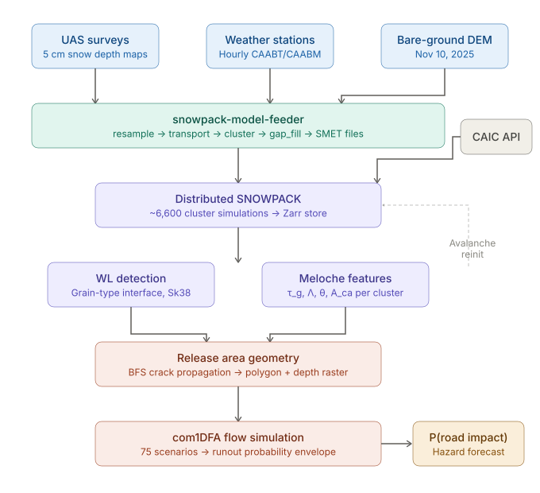
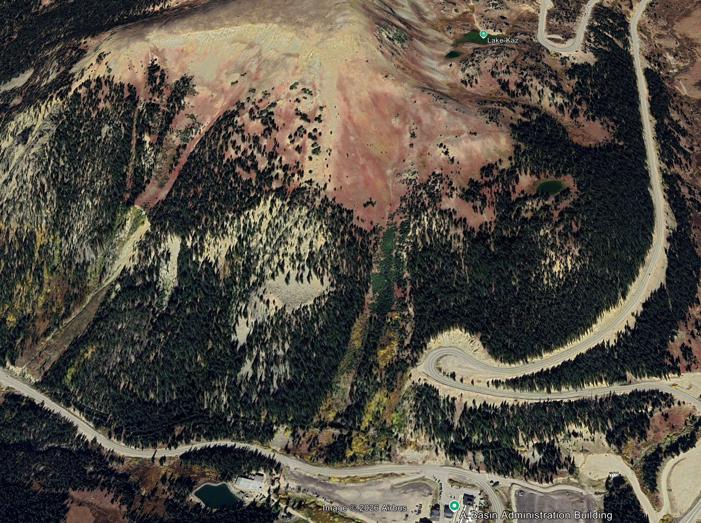
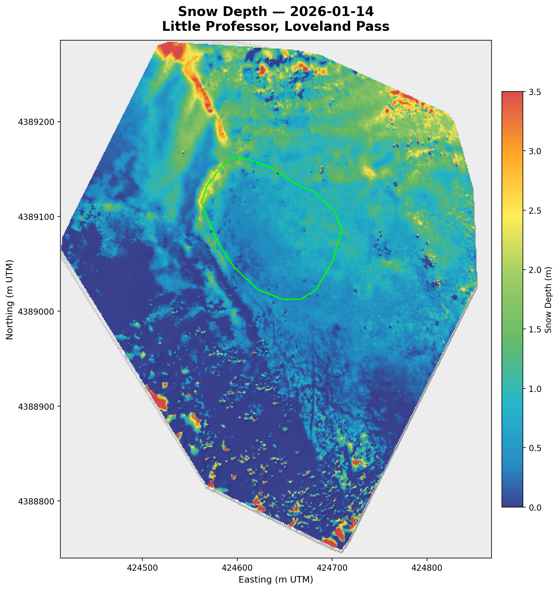
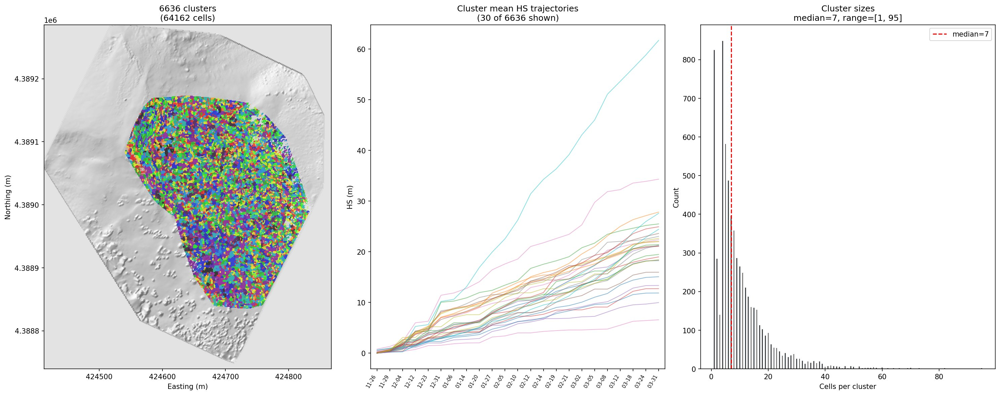
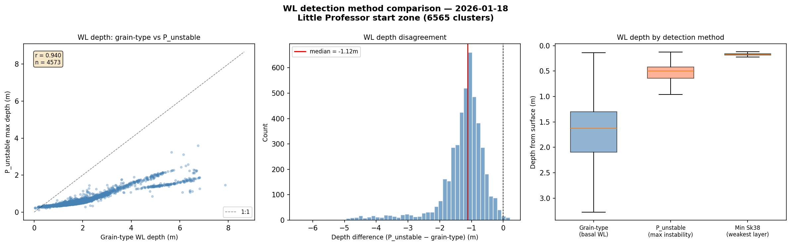
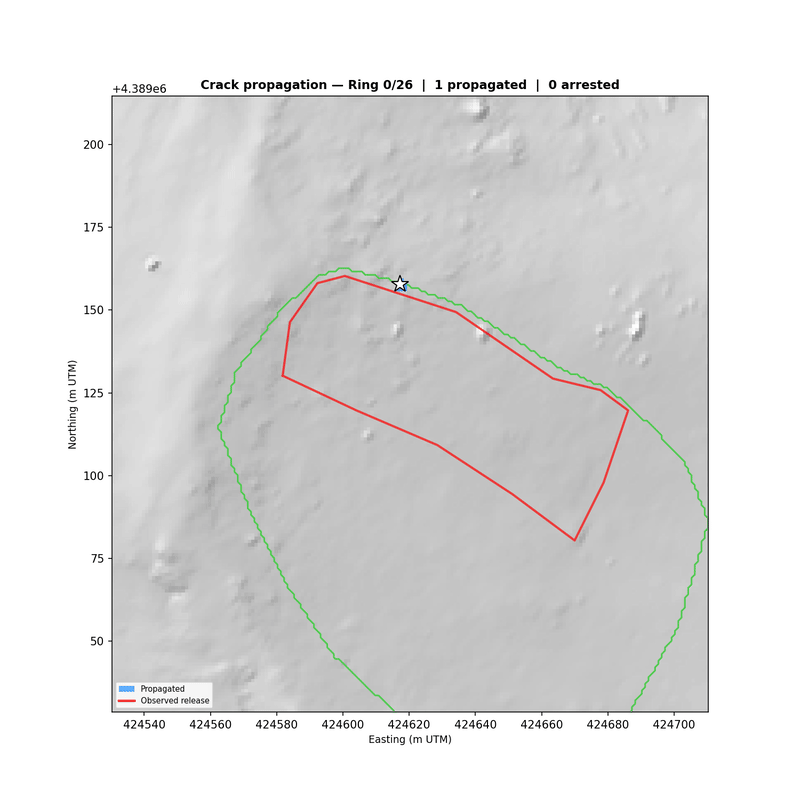
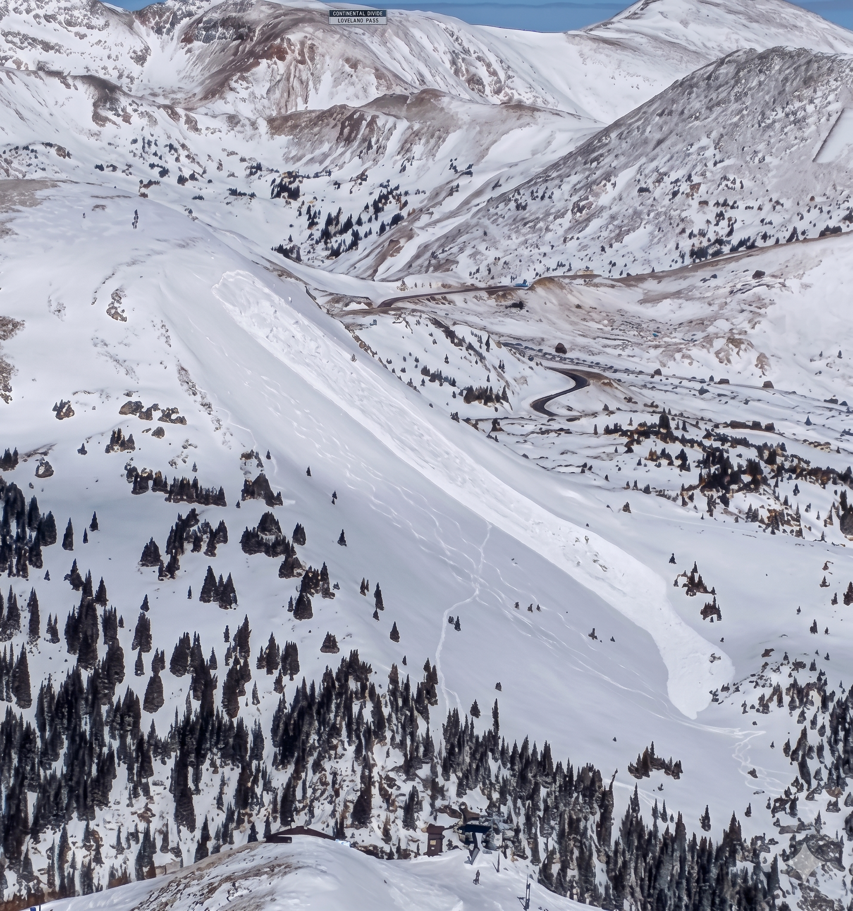
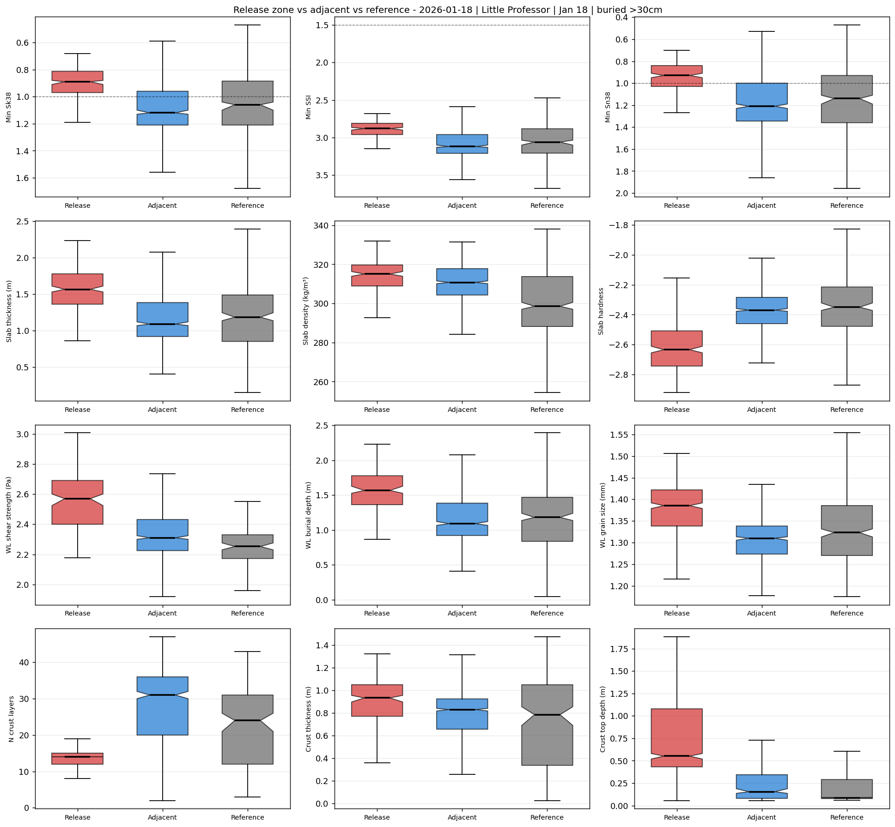

# Avalanche Model Chain: Project Description

**Project:** UAS-Driven Avalanche Hazard Assessment for Highway Corridors  
**Study site:** Little Professor avalanche path, Loveland Pass (US-6), Colorado  
**Team:** Ron, Ryan, Valerie, Snook  
**Last updated:** 2026-05-12

---

## 1. Problem Statement

Colorado's mountain highways cross dozens of avalanche paths managed by dedicated highway avalanche programs. These programs are proactive: experienced forecasters assess specific paths using weather observations, snowpit data, and decades of institutional knowledge, then conduct active mitigation — artillery, explosives, and helicopter delivery — to control avalanche hazard before it threatens traffic.

The challenge is that some avalanche paths have return periods long enough that even experienced forecasters may not have witnessed enough significant cycles on a given path to develop the intuition needed for optimal mitigation timing. This creates two costly failure modes: mitigation triggered too frequently produces unnecessary road closures and wasted resources, while mitigation timed too late or under unfavourable conditions can produce controlled avalanches larger than intended, requiring extended closures for debris removal. Both outcomes impose economic costs and erode operational confidence.

Case example: Bathel, I-70 — March 7, 2019. After two consecutive major storms, CDOT and CAIC avalanche crews conducted mitigation on the Bathel avalanche path above Interstate 70 near Herman Gulch, approximately three miles east of the Eisenhower-Johnson Memorial Tunnel. The first explosive charge triggered a historically large avalanche that buried both directions of the interstate — 15 feet of snow across the westbound lanes, 8 feet on the eastbound side, along with trees and rocks. It took maintenance crews approximately 11 hours to clear the debris and reopen the road. For those 11 hours, a 27-mile stretch of the primary transportation corridor between eastern and western Colorado was closed.

If mitigation teams had access to quantitative information about the snowpack volume in the starting zone and the potential avalanche size from this path before the second storm, they might have chosen to mitigate after the first storm, when the release would have been smaller, the debris more manageable, and the road closure shorter. The Bathel event illustrates the core value of this system: spatial quantification of snowpack conditions and avalanche size potential supports better-timed mitigation decisions, reducing both the magnitude of controlled releases and the duration of road closures.

What's missing is a quantitative, spatially distributed assessment that complements forecaster expertise: how does the snowpack vary across a release zone? Where exactly is the weakest point? How much snow would release under current conditions, and what is the probability that debris reaches the road? These questions require spatial resolution that point observations cannot provide. The system described here is a tool for experienced forecasters, it adds spatial quantification and probabilistic runout estimates to support mitigation timing decisions, particularly on paths where direct observational history is limited.

The fundamental question for highway operations is: will the avalanche reach the road, and when should we act? Answering this requires knowing where the snowpack is weakest, how much snow will release, and how far the debris will travel, at the specific path, not regionally.

---

## 2. Solution Approach

We are developing an end-to-end model chain that transforms UAS snow depth surveys into spatially explicit runout probability envelopes for highway avalanche paths. The chain couples four components:

1. **Spatially distributed snowpack simulation** — UAS-derived snow depth maps provide the spatial forcing for SNOWPACK, a physics-based snow cover model, at ~6,600 locations across the avalanche path. Each location receives its own hourly forcing and evolves an independent stratigraphic profile.

2. **Release area determination** — A physics-based crack propagation model (after Meloche et al., 2025) identifies where the snowpack is most likely to fail and how far the fracture propagates. The model uses distributed slab and weak-layer properties from SNOWPACK to delineate release polygons.

3. **Flow dynamics simulation** — The release polygon and depth raster feed com1DFA (AvaFrame), a depth-averaged flow model that simulates the avalanche as it descends the track and deposits on the runout zone.

4. **Probabilistic hazard envelope** — Multiple scenarios (varying trigger location, release area size, slab depth, and flow parameters) produce an ensemble of runout extents. The envelope is the probability that debris reaches any given point on the road.

The chain is designed for both retrospective validation (did the model predict the Jan 18, 2026 event?) and operational forecasting (what will conditions look like tomorrow?). The operational mode extends the pipeline with NWP forecast data to provide 72-hour rolling hazard forecasts with quantified uncertainty. See `operational_design.md` for the full operational architecture.

  
*Figure 10: End-to-end model chain. UAS snow depth surveys and weather station data feed the snowpack-model-feeder pipeline, which generates per-cluster SMET forcing for distributed SNOWPACK simulation. SNOWPACK stratigraphy feeds the Meloche et al. (2025) release area model, which produces release polygons and depth rasters for com1DFA flow simulation. The ensemble of runout extents produces a probability envelope for infrastructure impact assessment. [TODO: insert pipeline flow diagram]*

---

## 3. Study Site

  
*Figure 1: Little Professor avalanche path on the south side of Loveland Pass (satellite imagery, summer). The starting zone is the open alpine terrain in the upper-centre. US-6 is visible as the switchback road at the bottom and right. The A-Basin Administration Building is at the lower right. The avalanche path runs from the starting zone (elev. ~3,750 m) through the gully to US-6 (~3,350 m), a vertical drop of ~400 m.*

Little Professor is a southeast-facing (aspect ~138°) avalanche path on the north side of Loveland Pass, directly above US-6. The starting zone spans elevations of approximately 3,650–3,750 m with slope angles of 25–45°. A flat northwest-facing fetch area above the starting zone provides a wind-loading source that builds deep wind slabs on the upper slope.

The path is classified as a persistent slab problem. Colorado's continental snowpack is characterised by strong temperature gradients that produce basal faceted layers (FC, DH) early in the season. These weak layers persist throughout the winter, buried under progressively deeper slabs. The Jan 18, 2026 event — a D2 skier-triggered slab avalanche — failed on this basal facet layer at approximately 1.6 m depth.

The path terminates at US-6 (Loveland Pass road), making it a direct infrastructure hazard. Five ski tracks were observed within 10–20 m of the right flank of the release area, providing a natural control: the snowpack was stable enough for skier traffic immediately adjacent to the release zone.

---

## 4. Data

### 4.1 UAS Snow Depth Surveys

Twenty-three UAS surveys were collected between November 2025 and March 2026 using a DJI drone with PPK georeferencing, processed in SiteScan using Structure-from-Motion photogrammetry. Each survey produces a Digital Surface Model (DSM) at approximately 5 cm resolution. Snow depth is computed as HS = snow-on DSM − bare-ground DSM.

**Bare-ground reference:** The November 10, 2025 bare-ground DSM serves as the reference surface. It was acquired before the first snowfall of the season. An earlier reference (November 26 DSM) was used in initial development but was found to contain residual snow cover, producing systematically low HS values.

  
*Figure 2: Snow depth map from the January 14, 2026 UAS survey (4 days before the avalanche event). Depth ranges from 0 m (bare ground, dark blue) to >3 m (wind-loaded areas, red). The wind pillow at the upper-left of the starting zone is clearly visible. Generate with: `python scripts/generate_hs_figure.py --date 2026-01-14 --show-release --output assets/fig_02_snow_depth_map.png`*

**Co-registration:** The bare-ground DSM required co-registration to the survey coordinate frame (2.776 m Y-axis shift). All surveys and the bare-ground DSM share NAD83(2011) / UTM Zone 13N + NAVD88 height (EPSG:6342 + 5703). Co-registration was verified by comparing origins: dx = 0.000 m, dy = 0.000 m after correction.

**Survey quality:** A season-wide audit (see `25_26_Season_Survey_Data_Quality_Review.pdf`) identified several data quality characteristics relevant to downstream modelling:

- Absolute snow depth RMSE against ground-probed depths: approximately 0.6 m (based on 13 probe locations from Jan 14, 2026).
- Flight-to-flight differential RMSE: approximately 0.36 m (median), roughly 1.6× better than absolute RMSE. Snow depth *change* between flights is more reliable than absolute depth on any single flight.
- A persistent stake-positive, rock-negative residual pattern at virtual ground control points (vGCPs) accounts for 67% of post-correction variance. This pattern cancels in flight-to-flight differencing.
- Five flights (Dec 12, Dec 31, Feb 12, Mar 2, Mar 8) carry elevated RMSE (1.35–1.64 m) and should be treated with caution.
- All flights resolved as PPK float-only (Q=2) over a 47.9 km baseline. No fixed-ambiguity solutions were achieved.

The fundamental limitation is the absence of surveyed ground control points (GCPs). Each flight is georeferenced independently, producing meter-scale relative positioning errors between flights. The planned fix — RTK-surveyed ground control for the 2026/27 season — addresses alignment at the source rather than through post-processing corrections.

**Implications for the model chain:** The 0.6 m absolute RMSE propagates into SNOWPACK as HS forcing uncertainty. At the cluster scale (~5 m diameter, ~7 pixels), spatial averaging reduces per-cluster error, but systematic biases (e.g., aspect-correlated residual structure) are not removed by averaging. The operational performance monitoring system (§11 in `operational_design.md`) tracks survey correction magnitude as a measure of gap-fill model accuracy.

### 4.2 Weather Station Data

Hourly meteorological data from two CAIC A-Basin stations:

- **CAABT** (summit/weather): temperature, humidity, wind speed/direction, solar radiation, precipitation
- **CAABM** (base): snow depth (in tenths of inches, converted via ÷10 × 2.54 to cm)

All timestamps are UTC. Station data gaps are filled using the refill algorithm in `step_smet`. The longest gap observed was 34 hours (Dec 18, 2025). Station depth data provides the hourly HS evolution between UAS surveys; the gap-fill model distributes this station-scale signal spatially using the transport patterns from the surveys.

### 4.3 Avalanche Observations

CAIC avalanche observations are fetched via the CAIC API (paginated, last 100 records, `observed_at` as primary date field). The Jan 18, 2026 D2 skier-triggered event on Little Professor is the primary validation case. The observed release area (3,902 m²) was delineated from UAS survey differencing using the min-kernel detection method (see `avalanche_handling.md`).

---

## 5. Model Chain

### 5.1 Snow Depth Distribution (snowpack-model-feeder)

The `snowpack-model-feeder` pipeline transforms periodic UAS surveys and continuous station weather data into hourly per-cluster SMET forcing files for SNOWPACK. The pipeline has eight steps:

**resample** → **transport** → **features** → **train** → **avalanche** → **cluster** → **gap_fill** → **smet**

The core challenge is temporal: UAS surveys provide high-resolution spatial snapshots every 1–2 weeks, but SNOWPACK needs hourly forcing. The gap-fill model disaggregates station-scale hourly dHS using the spatial transport patterns observed between consecutive surveys. See `TRANSPORT_MODELS.md` for the transport model details.

**Clustering:** The 1 m DEM is partitioned into ~6,600 clusters using PCA (95% variance) + MiniBatch K-means with recursive splitting. The stopping criterion is `max_cluster_std_m = 0.08 m` (8 cm intra-cluster HS standard deviation) with a minimum cluster size of 4 pixels. Each cluster receives a single SMET file and a single SNOWPACK simulation. See `clustering.md` for the full algorithm.

  
*Figure 3: Cluster partitioning for the Little Professor domain. Left: 6,565 clusters (64,105 cells) overlaid on hillshade, each colour representing a distinct cluster with its own SNOWPACK simulation. Centre: mean HS trajectories for 30 representative clusters showing the diversity of accumulation patterns — upper-slope wind pillows accumulate 3× faster than wind-scoured areas. Right: cluster size distribution (median = 7 pixels, range 1–103).*

### 5.2 Snowpack Simulation (SNOWPACK)

SNOWPACK is run independently at each cluster location. The simulation evolves the full stratigraphic profile (layer-by-layer density, grain type, grain size, temperature, stability indices) from bare ground through the season. Key configuration: `ENFORCE_MEASURED_SNOW_HEIGHTS=TRUE` — SNOWPACK adjusts its internal HS to match the SMET forcing at each timestep, adding or removing surface layers as needed.

Output is stored as `.pro` files (profile time series) and aggregated into a Zarr store for efficient analysis. The Zarr contains ~30 per-layer variables (density, grain_type, sk38, ssi, sn38, shear_strength, Lambda, etc.) at all cluster locations and all timesteps.

**Avalanche reinitialization:** When an avalanche is detected (from UAS survey differencing), the affected cluster `.sno` files are scoured by removing layers from the top down to the slab/WL interface depth. A two-pass SNOWPACK workflow (run to event → scour → rerun from event) handles this. See `avalanche_handling.md` for the detection and reinitialisation workflow.

### 5.3 Weak Layer Detection

The failure plane is identified by `split_wl_slab()`, which scans upward from the snowpack base through FC (grain type 4xx) and DH (grain type 5xx) codes until the first transition to slab grain types (RG, DF, PP, etc.). This targets the persistent basal weak layer — the failure plane for Colorado's continental slab avalanches.

Stability indices (Sk38, SSI, Sn38) are extracted within a ±5 cm window of the WL/slab interface. The interface-specific Sk38 is the primary trigger selection metric: clusters with Sk38 < 1.0, tau_g ≥ 50 Pa, slope ≥ 30°, and slab thickness between 0.5–2.0 m are trigger candidates for skier-triggered scenarios.

**Comparison with SNOWPACK's built-in stability indices:** SNOWPACK's structural stability index S' (`stab_deformation_rate`) was evaluated as an alternative WL detection method. S' saturates at 6.0 for all clusters with zero spatial discrimination between the release area and adjacent stable terrain. The grain-type method finds the WL at median 1.62 m depth (basal), while profile-wide minimum Sk38 is at median 0.17 m (near-surface). For persistent slab avalanches in Colorado, depth matters more than index value — the grain-type method correctly targets the failure plane. See `compare_wl_methods.py` for the full comparison.

  
*Figure 4: Weak layer detection method comparison at the Jan 18 snapshot. Left: grain-type WL depth vs S' depth — correlation is high (r = 0.94) but S' is biased 1.12 m toward the surface. Centre: depth difference histogram showing S' consistently finding shallower layers. Right: boxplot of WL depth by method. The grain-type method targets the basal persistent WL at ~1.6 m; S' and profile-wide min Sk38 find near-surface instabilities. Image: `outputs/plots/wl_method_comparison_2026-01-18.png`*

### 5.4 Release Area Geometry

The release area is determined by a physics-based BFS crack propagation model after Meloche et al. (2025). Starting from the trigger cluster, the model propagates the crack outward through the cluster neighbourhood graph, arresting where slab properties change sufficiently to stop fracture propagation.

**Arrest criteria (9 conditions, in order):**

1. Outside start zone KML boundary
2. Distance caps (upslope ≤ A_ca, downslope ≤ stauchwall distance, lateral ≤ Gaume width)
3. Downslope slope < 28° (stauchwall)
4. tau_g < 50 Pa (absolute floor)
5. tau_g < 40% of trigger's tau_g (relative drop, downslope/lateral only)
6. Slab thickness < 0.3 m (too thin for fracture)
7. Lambda < 0.5 m (slab too weak/compliant)
8. |ΔΛ/Λ| > 50% (Lambda discontinuity)
9. |Δh/h| > 25% (slab thickness discontinuity)

The relative tau_g arrest (#5) is applied only downslope and laterally — upslope propagation is driven by stored elastic energy and naturally has lower local tau_g as terrain flattens toward the ridge.

A probabilistic boundary model (logistic regression on cluster-pair transitions) was developed in parallel but currently has insufficient discriminative power (ROC-AUC = 0.586, 0% boundary recall) with a single training event. It requires ≥3–5 events to produce meaningful predictions.

See `release_area_geometry.md` for the complete method description, calibrated parameters, and validation.

  
*Figure 5: Distributed Meloche et al. (2025) feature fields at the cluster scale. Panels show slab thickness, Lambda (elastic length), tau_g (driving stress), theta (WL shear strength gradient), A_ca (crack arrest length), and slope angle. The observed release boundary (red) overlays the strongest tau_g contrast (2.31× ratio at the boundary). Note: figure shown is from Jan 17 snapshot with pre-fix parameters — regenerate with Jan 18 snapshot after BFS recalibration.*

  
*Figure 6: BFS crack propagation from trigger cluster, showing arrest reasons at each boundary segment. Blue = propagated clusters; coloured boundaries show arrest type (yellow = tau_g < 50 Pa, orange = distance cap, teal = thickness discontinuity, purple = Lambda discontinuity, red = stauchwall). Note: regenerate with current arrest criteria (includes relative tau_g, min Lambda, lateral cap) after BFS recalibration.*

### 5.5 Scenario Ensemble

Each trigger produces multiple scenarios by varying three axes:

- **Size factor** (0.70–1.30): scales the BFS arrest thresholds, producing smaller/larger release polygons
- **Depth percentile** (P10, P50, P90): scales the depth raster within the release polygon
- **Trigger location** (n_triggers, typically 1–5): uses the top-ranked trigger candidates by Sk38

Each scenario produces a release polygon (GeoJSON), a depth raster (ASCII grid + PRJ sidecar), and a parameter file (JSON) for com1DFA. Scenario weights are assigned based on Sk38 ranking and depth percentile probability. See `scenario_writer.py` for the output format.

### 5.6 Flow Dynamics (com1DFA / AvaFrame)

The release polygons and depth rasters feed com1DFA (AvaFrame), which simulates the flowing avalanche using a depth-averaged flow model. An initial 75-scenario ensemble run (May 11, 2026) produced the following results:

| Metric | Value |
|--------|-------|
| Scenarios | 75 |
| Friction model | samosAT Medium |
| Mesh resolution | 1.0 m |
| Entrainment | Disabled |
| Max runout distance | 806 m |
| Scenarios reaching road | 1 / 75 |
| P(reach road) | 0.01 |
| Envelope area (P ≥ 0.05) | 60,550 m² |
| Max impact velocity | 31.6 m/s |
| Max flow depth | 5.1 m |
| Max pressure | 315 kPa |

Voellmy parameters μ and ξ are currently set by the samosAT Medium friction model defaults — not yet calibrated to Little Professor. Calibration against the Jan 18 observed runout is planned. Entrainment is disabled pending resolution of a com1DFA raster-depth input issue.

  
*Figure 7: Runout probability envelope from the 75-scenario com1DFA ensemble (preliminary, samosAT Medium friction). The probability heatmap (yellow = high, blue = low) shows the most likely flow path from the release zone to US-6 (orange line, lower right). Red contours show individual scenario extents. One scenario (1/75) reaches the road. The interactive viewer is available at: https://nwp.mtnweather.info/val/SNOWPACK_runout_260511_newViewer.html*

The ensemble of runout extents produces a probability envelope:

**P(exceedance at road) = P(release at this location) × P(runout reaches road | release)**

This is the operationally actionable output: the probability that an avalanche starting from this release area deposits debris on the road.

---

## 6. Validation: January 18, 2026 Event

### 6.1 Event Description

  
*Figure 11: The January 18, 2026 D2 skier-triggered slab avalanche on Little Professor, viewed from Loveland Ski Area. The release area, track, and deposit are visible. Five ski tracks are present within 10–20 m of the right flank.*

On January 18, 2026, a skier triggered a D2 persistent slab avalanche on the Little Professor path. The avalanche failed on basal faceted layers (FC/DH) at approximately 1.6 m depth, with a release area of 3,902 m² measured from UAS survey differencing (Jan 14 → Jan 20). Five ski tracks were visible within 10–20 m of the right flank boundary — the snowpack was stable for skier traffic immediately adjacent to the release zone.

### 6.2 Release Area Prediction

**Note:** Validation results are under active recalibration following the DEM change (Nov 26 snow-covered DSM → Nov 10 bare-ground DSM), grain-type classification fix, and new arrest criteria. Results below reflect the current state of calibration.

| Metric | Value |
|--------|-------|
| Observed release area | 3,902 m² |
| Modeled release area (BFS, sf=1.0) | ~1,500–3,200 m² (under calibration) |
| Area ratio (model/observed) | ~0.39–0.83 (under calibration) |
| Trigger location | Inside observed release area (upper slope) |
| Crown position | Consistent with observed crown |

  
*Figure 8: Release polygon comparison for the Jan 18 event. Blue = Meloche-derived BFS polygon; red = observed release area (3,902 m²); green = start zone boundary. The star marks the trigger cluster centroid. Current result with corrected grain-type extraction and Nov 10 bare-ground DEM.*

The BFS model correctly places the trigger in the upper portion of the observed release area. The polygon overlaps the observed release well in the upper and left flanks. The current undersizing is from arrest thresholds that were calibrated against the old (buggy) grain-type extraction and need re-tuning with the corrected Meloche parameters. The key boundary discriminator is tau_g contrast (2.31× between release and adjacent median values).

### 6.3 Avalanche Detection

  
*Figure 9: Avalanche release boundary detected from dHS between Jan 14 and Jan 20 surveys using the min-kernel method (kernel_size=7, threshold_sigma=1.2). IoU = 0.55–0.64 against a hand-drawn boundary. [TODO: regenerate with current DEM]*

The min-kernel detection method identifies the release boundary from dHS between pre-event (Jan 14) and post-event (Jan 20) surveys with IoU = 0.55–0.64 against a hand-drawn boundary. See `avalanche_handling.md` for the method comparison (min-kernel vs Canny+watershed).

### 6.4 Stability Comparison

The following stability indices were evaluated for their ability to discriminate between the release area and adjacent stable terrain:

| Index | Release area | Adjacent | Discrimination |
|-------|-------------|----------|----------------|
| Sk38 at basal WL (grain-type interface) | median 0.89 | median 0.97 | Moderate |
| tau_g (driving stress) | median 536 Pa | median 232 Pa | Strong (2.31×) |
| Lambda (elastic length) | median 1.68 m | median 1.27 m | Moderate (1.32×) |
| S' (stab_deformation_rate) | 6.0 (saturated) | 6.0 (saturated) | None |
| Profile-wide min Sk38 | 0.07 | 0.07 | None |

tau_g provides the strongest spatial discrimination. S' and profile-wide min Sk38 are useless for this snowpack type — they saturate or find near-surface instabilities everywhere. The grain-type method correctly targets the basal persistent WL at 1.6 m depth.

---

## 7. Limitations

### 7.1 Input Data

- **Survey accuracy:** 0.6 m absolute RMSE (single validation point). The 0.36 m differential RMSE is more relevant for the transport model but still represents significant uncertainty at the slab-thickness scale.
- **No surveyed GCPs:** Flight-to-flight positioning is not reliable at sub-meter level. Meter-scale horizontal shifts produce aspect-correlated snow depth biases that propagate into SNOWPACK.
- **Single validation event:** All calibration (arrest thresholds, trigger selection filters) is based on one D2 event on one path. Multi-event, multi-path validation is required before operational deployment.
- **Station representativeness:** The gap-fill model assumes station dHS is representative of domain-wide accumulation patterns. Wind events can invalidate this assumption between surveys.

### 7.2 Model Chain

- **Cluster resolution (~5 m):** Smooths slab property gradients relative to SMP-scale measurements. Gradient-based arrest criteria reflect this averaging.
- **Grain-type WL detection:** Assumes the deepest FC/DH layer is always the failure plane. Mid-pack WLs from buried surface hoar or crust-facet combinations are not targeted.
- **Stability window (±5 cm):** The Sk38 extraction window size affects which layers contribute to the stability assessment. Sensitivity to this parameter has not been fully characterised.
- **BFS arrest thresholds:** Under recalibration. The LAMBDA_JUMP_FACTOR and THICKNESS_JUMP_FACTOR values were originally calibrated with a grain-type classification bug (`>= 4` instead of `== 4 or == 5`). The corrected Meloche parameters produce smoother spatial gradients at the boundary.
- **Probabilistic boundary model:** ROC-AUC = 0.586 with zero boundary recall. Requires more training events.
- **Voellmy parameters uncalibrated:** μ = 0.155 and ξ = 1500 m/s² are literature defaults, not calibrated to Little Professor.
- **S' mislabeled as P_unstable:** The initial comparison used SNOWPACK's `stab_deformation_rate` (S') and mislabeled it as P_unstable. The Mayer et al. (2022) P_unstable is a separate random forest model not currently implemented. S' saturation at 6.0 is a valid finding; the label has been corrected.

### 7.3 Operational

- **No NWP integration yet:** The 72-hour forecast mode is designed but not implemented. Daily forward mode and survey correction mode are implemented in shell scripts.
- **Single path:** Currently validated on Little Professor only. Extension to Widowmaker, Muleshoe, and other US-6 paths is planned.

---

## 8. Future Work

### Near-term (ISSW 2026)

- Complete BFS arrest threshold recalibration with corrected Meloche parameters
- Calibrate Voellmy μ/ξ against Jan 18 observed runout (Val)
- Produce runout probability envelope for US-6 road polygon
- Cross-date Meloche analysis (Jan 10, 14, 17, 18) showing instability evolution toward the event
- Evaluate Mayer et al. (2022) P_unstable RF model with published Alpine weights on Colorado data

### Medium-term (2026/27 season)

- RTK-surveyed ground control for UAS surveys (summer 2026 field plan)
- Automated daily operational pipeline with NWP 72-hour forecasts
- Multi-event calibration (accumulate 3–5 events for probabilistic boundary model training)
- WindNinja wind field library for improved RF transport model
- Extension to Widowmaker and Bethel paths

### Long-term

- Colorado-specific instability model trained on accumulated events
- Multi-path corridor-scale hazard assessment
- Integration with CDOT road management systems
- Real-time hazard dashboard for operations teams

---

## 9. Related Documents

| Document | Contents |
|----------|----------|
| `release_area_geometry.md` | Complete release area method: trigger selection, BFS arrest criteria, probabilistic model, calibrated parameters, validation |
| `operational_design.md` | Operational architecture: daily forward mode, NWP forecasts, survey correction, efficiency, cluster management, monitoring, performance reporting |
| `avalanche_handling.md` | Avalanche detection (min-kernel vs Canny+watershed), SNOWPACK reinitialization workflow, transport correction |
| `TRANSPORT_MODELS.md` | Snow transport model: wind-energy disaggregation, RF regression, gap filling |
| `clustering.md` | Cluster algorithm: PCA + K-means + recursive splitting + contiguity enforcement |
| `TODO.md` | Prioritised task list with operational mode, NWP forecast, cluster management, P_unstable evaluation |
| `25_26_Season_Survey_Data_Quality_Review.pdf` | Season-wide UAS survey audit: co-registration, cross-flight repeatability, probe comparison, outlier analysis, summer 2026 field plan |

---

## 10. References

Gaume, J., van Herwijnen, A., Chambon, G., Wever, N., and Schweizer, J. (2017). Snow fracture in relation to slab avalanche release: critical state for the onset of crack propagation. *The Cryosphere*, 11(1), 217–228.

Mayer, S., van Herwijnen, A., Techel, F., and Schweizer, J. (2022). A random forest model to assess snow instability from simulated snow stratigraphy. *The Cryosphere*, 16(11), 4593–4615.

Meloche, F., Bhatt, A., Gauthier, F., and Hébert-Houle, P.-É. (2025). Spatial variability of slab properties as a control on avalanche release area geometry. *Journal of Glaciology*.

Schweizer, J. and Jamieson, J. B. (2007). A threshold sum approach to stability evaluation of manual snow profiles. *Cold Regions Science and Technology*, 47(1–2), 50–59.
