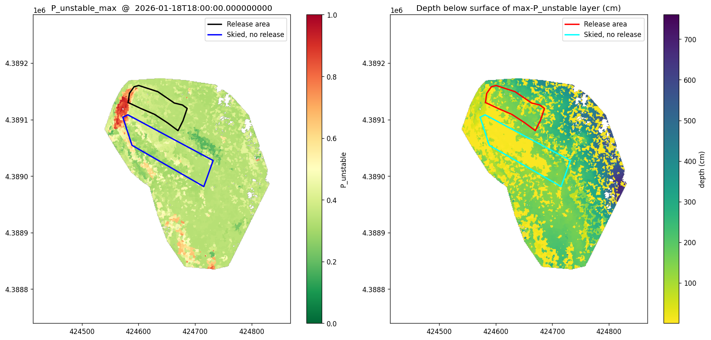
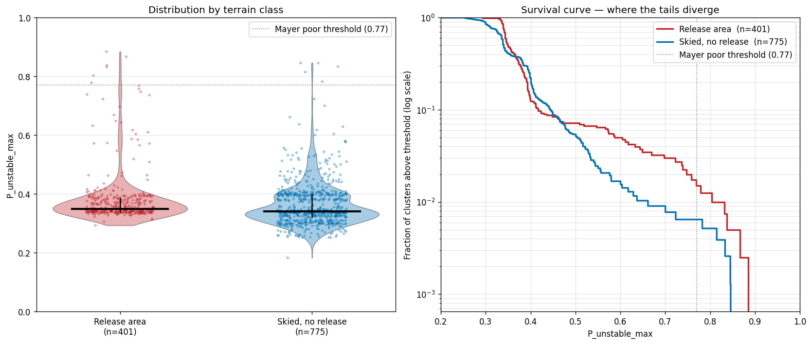

# Testing Mayer P_unstable on a Continental Slope

**A same-day, same-slope comparison between triggered and skied-but-stable terrain.**

## Background

The Little Professor avalanche path near A-Basin/Loveland Pass, Colorado, is a pilot site for a decision-support pipeline to produce runout probability maps for highway avalanche corridors. The chain begins with high-resolution UAS snow-depth surveys (5 cm GeoTIFFs, roughly twice weekly through the season) and hourly weather from local stations. UAS-derived HS is differenced against a bare-ground DEM and gap-filled between flights using station weather, then used to drive distributed SNOWPACK simulations across ~6,600 clusters into which the slope is partitioned by recursive variance-based splitting, each cluster a contiguous region within which the seasonal HS progression is statistically homogeneous, with one SNOWPACK simulation per cluster. From the resulting per-cluster stratigraphies, a gradient-arrest physics model bounds the release area by flood-filling outward from candidate trigger clusters until local gradients in slab and weak-layer properties exceed arrest thresholds. The downstream goal is feeding those release polygons into AvaFrame's com1DFA flow model to produce runout probability envelopes for the road below.

This evaluation asks whether a layer-resolved profile-stability classifier provides useful additional information at the release-area stage when applied to Colorado continental snowpack.

The P_unstable model of Mayer et al. (2022) is a random forest classifier trained on Swiss Alps snow profiles. Given a SNOWPACK simulation, it returns a probability of mechanical instability for every layer in the profile, based on six per-layer features: viscous deformation rate, critical crack length, sphericity, grain size, skier penetration depth, and a slab density-to-grain-size integral. Maritime-to-intermountain Alpine profiles dominate the training distribution. Colorado's continental snowpack, heavily faceted, dry, and frequently depth-hoar-dominated, sits well outside that training distribution.

On January 18, 2026, a D2 dry slab avalanche released on the Little Professor avalanche path. The slope was skied that morning, with multiple parties on it the day of the avalanche release. The trigger came from one party in the upper release area; other skiers traversed the adjacent section of the slope terrain without triggering an avalanche. This event offers an unusually clean validation opportunity: the same slope, the same loading regime, the same day, the same snowpack, but two very different outcomes in adjacent slope sections.

## The comparison

*Figure 1: Jan 18 slope photo showing the release area alongside the ski tracks that did not trigger.*

The validation question is direct: at a timestep just before the trigger, does Mayer P_unstable assign systematically higher instability to the clusters that subsequently released than to clusters in adjacent terrain that was actively skied but did not avalanche?

Two polygons digitized from the post-event UAS orthomosaic define the comparison. The release area is the swath of terrain that moved during the Jan 18 event. The skied, no-release area is the adjacent terrain showing visible ski tracks but no observed propagation. Naive comparisons of "in-release vs. everywhere-else-on-the-slope" don't actually test the model — they dilute the comparison with terrain nobody skied, terrain at the wrong elevation, terrain without sufficient loading. Differences in that comparison are guaranteed and tell us little about model usefulness. The right counterfactual is "this is what the snow looked like where skiers triggered" against "this is what the snow looked like a few meters away where skiers didn't."

## Methods, briefly

Full implementation notes are in [`punstable_evaluation_method.md`](punstable_evaluation_method.md). At a high level, for each of ~6,500 clusters in the Little Professor domain we compute Mayer's six input features per snow layer from the existing SNOWPACK output, apply the published trained RF model, and take the maximum P_unstable across all layers in each cluster's profile as the per-cluster instability score. We then partition clusters by polygon membership and compare distributions at the snapshot 2026-01-18 18:00 UTC (11 AM MST), a few hours before the trigger.

Two practical details that mattered: the published RF was saved with scikit-learn 0.22 internals that don't load cleanly in modern sklearn, so prediction runs in an isolated Python 3.8 environment with feature extraction and Zarr ingest in the main environment. Mayer's `rc_flat` feature is computed in Python from the Gaume formula rather than taken from SNOWPACK's slope-aware variable 0606, because the RF was trained on the flat-surface form.

## Findings

*Figure 2: P_unstable_max across the slope at 2026-01-18 18:00 UTC, with release and skied polygons overlaid. Left: P_unstable_max colored by cluster across the Little Professor domain. Right: depth below surface of the worst layer. Both panels overlay the digitized release area and the skied-no-release area. In these images, the upper polygon is the release area, and the lower polygon is where people skied/ride and did not triggered an avalanche*

The Mayer model correctly identifies the basal faceted weak layer as the failure plane across essentially the entire slope. At the Jan 18 snapshot, 95.6% of clusters have their worst layer in faceted crystals (FC) and another 4.3% in depth hoar (DH), the Colorado continental signature, picked up by an Alpine-trained classifier without being told to look there. As internal validation that the model is responding to physically meaningful stratigraphic features rather than pattern-matching to Alpine-specific layer types, this is a strong result. It also cross-validates our existing basal-WL search (`split_wl_slab`), the two approaches converge on the same layer at 99.9% of locations.

The spatial discrimination story is more nuanced.

*Figure 3: Distribution comparison: release area vs skied-no-release. Left: violin and jittered scatter showing the full distribution shape for each terrain class. Right: survival curve on a log y-axis showing where the upper tails diverge.*

The two distributions are dominated by overlap. Release-area clusters have a median P_unstable_max of 0.349; skied-no-release clusters sit at 0.340 — a difference of 0.009. The interquartile ranges are essentially identical, and at the 75th percentile, skied terrain is actually slightly higher than the release area. Below P_unstable ≈ 0.5, the two distributions are indistinguishable.

The discrimination, such as it is, lives in the upper tail. At the 95th percentile the gap widens to 0.083, about ten times the median difference. At Mayer's "poor stability" threshold of 0.77, the release area shows 1.5% of clusters above (6 out of 401), versus 0.6% in the skied terrain (5 out of 775). That's a 2.5× lift, but on tiny absolute counts and indistinguishable at the next threshold up (0.92) where both areas have zero crossings. A Mann-Whitney U test of "release > skied" returns p = 3.8 × 10⁻⁹, significant by standard convention, but the test is responding to sample size (~1,200 clusters total) rather than to operationally meaningful effect size. The median difference of 0.009 is the number that matters operationally; the p-value is a distraction.

The most uncomfortable observation from the spatial map is that the single most-unstable cluster in the model (P_unstable_max = 0.952) lies outside the actual release area. A SNOWPACK profile inspection at that location suggests insufficient slab depth for crack propagation, the model is identifying a weak basal layer in a profile that physically couldn't sustain a propagating crack. Useful as a cautionary case study, but it underlines that high P_unstable alone is not a trigger prediction.

## Discussion

This evaluation does not produce a "the model works" or "the model fails" verdict, and we should resist framing it that way. The cleaner reading is that the Mayer P_unstable model and our gradient-arrest physics model are answering different questions.

Mayer's RF was trained on point profiles to answer *"is this profile stable?"* Given a column of snow, it returns the probability that a layer in that column is mechanically unstable. It implicitly assumes that profile-internal properties, the six features per layer, are what matter for triggering. In our Little Professor data this question gets a confident and physically sensible answer: yes, this profile is unstable, and the failure plane is in basal facets. That answer holds across nearly the entire slope.

What our work is trying to answer is a different question: *"which profile on this slope will trigger?"*, or more broadly, *"is this slope stable, and if not, where will it fail?"* This isn't a question about individual columns of snow; it's a question about spatial gradients, stress concentrators, and the geometry of the slab. The gradient-arrest physics model captures these because it computes spatial differences in slab and weak-layer properties between neighboring clusters and uses those differences to bound the release area. A profile-by-profile classifier, no matter how well calibrated, doesn't have direct access to that information.

That distinction matters for what we should conclude. The Mayer model performing weakly on spatial discrimination at Little Professor does not mean the model is inadequate for continental snowpack as a profile-stability assessment. It correctly identified the right weak layer almost everywhere; that's not nothing. What it does mean is that we shouldn't expect a profile-stability classifier, Alpine-trained or otherwise, to substitute for spatial release-area prediction. The two are complementary tools that answer complementary questions.

There is also a real possibility that with continental-snowpack training data and more validation events, the model would discriminate more sharply even on the spatial question. The training set is heavily weighted toward Swiss profiles. Colorado basal faceting produces feature distributions the model has seen less of, and the calibrated thresholds (P ≥ 0.77 for "poor," P ≥ 0.92 for "very poor") were tuned to Alpine observations. A version of this RF trained on a continental dataset, or a Colorado-specific dataset of triggered vs. non-triggered profiles at the cluster scale, might do considerably better. Until that work is done, the Mayer model on continental snow should be read as "evaluation incomplete, needs more validation on similar situations" rather than as a definitive assessment in either direction.

For the operational pipeline, the practical conclusion is that the dual-model design we already have, gradient-arrest physics for the spatial question, and a layer-resolved instability classifier as an independent confirmation of which layer to focus on, does the right job. Each model brings information the other lacks. Neither alone is sufficient. The empirical evidence from Little Professor is consistent with that interpretation.

## Known limitations

The validation set is a single event on a single slope. Multiple parties were on the slope through the morning; our snapshot at 11 AM MST may have preceded some of the skied tracks, which means the "skied, no-release" polygon includes terrain that hadn't yet been loaded by a skier at the snapshot time. The skied-no-release polygon was hand-digitized from the post-event UAS orthomosaic; we don't know the exact moments each ski track was made or how much loading those clusters had experienced before being skied.

The Mayer model was loaded from a pickle saved with scikit-learn 0.22.1. We use the original sklearn version in an isolated environment, but on newer hardware and a newer joblib release. A formal smoke test against the model authors' published reference outputs has not been performed; we are trusting that monotonic behavior on test inputs implies correct behavior on real ones. Implementation details for the Pk (skier penetration depth) feature simplify Mayer's contiguous-block MFcr accumulation to a single-layer check — defensible on Colorado snow where strong crusts are rare, but a deviation from the original.

The 2.5× lift at P ≥ 0.77 rests on six clusters in the release area against five in the skied terrain. Confidence intervals on that lift are wide. The lift number should not be reported quantitatively without the small-sample caveat.

## References

Mayer, S., van Herwijnen, A., Techel, F., Schweizer, J. (2022). A random forest model to assess snow instability from simulated snow stratigraphy. *The Cryosphere* 16, 4593–4615. https://doi.org/10.5194/tc-16-4593-2022

Random forest snow instability model (SLF code and trained model). https://gitlabext.wsl.ch/mayers/random_forest_snow_instability_model

Jamieson, J., Johnston, C. (1998). Refinements to the stability index for skier-triggered dry-slab avalanches. *Annals of Glaciology* 26, 296–302.

Bellaire, S. (2006). Modeling skier-triggered avalanches. Diploma thesis.

Richter, B., van Herwijnen, A., Rotach, M. W., Schweizer, J. (2019). Modeling the critical crack length using SNOWPACK.

