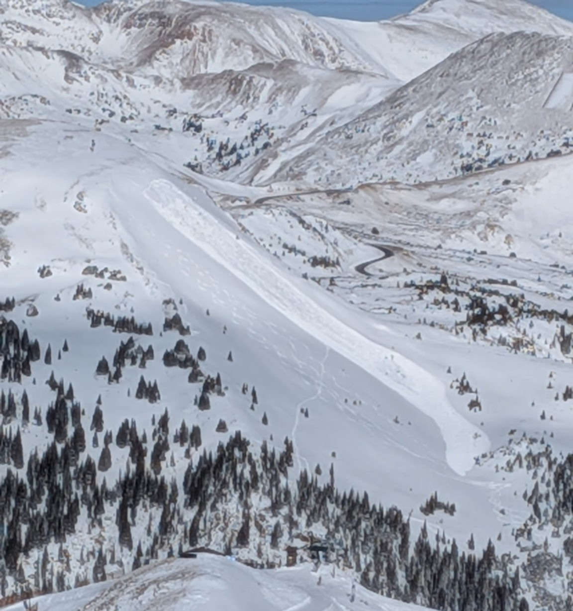
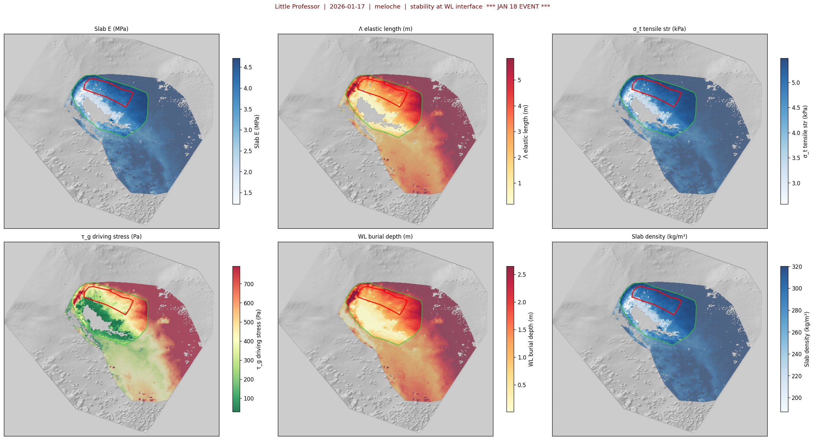

# Release Area Geometry: Method Documentation

**Project:** Little Professor Avalanche Path, Loveland Pass (US-6), Colorado  
**Pipeline step:** `step_scenarios` in `analysis_pipeline.py`  
**Key modules:** `release_geometry.py`, `snowpack_analysis.py`, `probabilistic_release.py`  
**Last updated:** 2026-04-20

---

## 1. Overview

This document describes how the pipeline generates release area polygons from distributed SNOWPACK simulations for input to the com1DFA flow model (AvaFrame). Two complementary approaches are implemented:

**Physics-based BFS model** — deterministic flood-fill from a trigger cluster, with arrest criteria derived from Meloche et al. (2025) and Gaume et al. (2015). Interpretable, parameter-efficient, works with zero prior events.

**Probabilistic boundary model** — logistic regression trained on labeled cluster-pair transitions from observed events. Data-driven, produces P(arrest) at each boundary, improves with each event.

These approaches are intentionally separate. They have complementary failure modes: the physics model has calibrated thresholds but cannot quantify its own uncertainty; the probabilistic model learns uncertainty from data but requires a training set. Together they provide a physically interpretable system whose uncertainty estimates are empirically calibrated and tighten over time — suited for a decision-support tool building toward runout probability envelopes.

The approach is motivated by the January 18, 2026 skier-triggered D2 slab avalanche on Little Professor, validated against the observed release area (3,902 m²) and the field observation that five ski tracks 10–20 m from the right flank did not trigger.



January 18, 2026 skier-triggered D2 slab avalanche on the Little Professor path, viewed from Loveland Ski Area. The release area is visible in the upper start zone (north-facing, above treeline), with the track running through sparse timber and the deposit terminating near US Highway 6. This event provides the end-to-end validation case for the model chain.

---

## 2. Input Data

### 2.1 Distributed SNOWPACK grid

SNOWPACK is run at every cluster location within a UAS-derived snow depth domain. Clusters are generated by k-means partitioning of the 1 m DEM within the start zone KML boundary (`clustering.py`). Each cluster has approximately 9–50 pixels at 1 m resolution (~3–7 m diameter). The Zarr cache stores the full stratigraphy time series for all 6,737 cluster locations.

### 2.2 Feature extraction

Two feature sets are produced by `step_analyze` in `analysis_pipeline.py`:

**Group-level features** (`release_zone_features_YYYY-MM-DD.csv`): extracted via `profile_features()` in `snowpack_analysis.py` for clusters assigned to release, adjacent, and reference groups.

**Full start zone features** (`all_start_zone_features_YYYY-MM-DD.csv`): produced when `--all-clusters` flag is set. Covers all ~2,455 start zone clusters. Required for the probabilistic boundary model's signed gradient features.

| Column | Units | Description |
|--------|-------|-------------|
| `min_sk38` | — | Minimum skier stability index at WL interface |
| `wl_shear_strength` | kPa | WL shear strength τ_p |
| `slab_thickness` | m | Depth from snow surface to WL top (burial depth) |
| `slab_density` | kg/m³ | Mean slab density ρ |

### 2.3 Meloche features

Two Meloche feature sets are produced by `compute_meloche_features()` in `snowpack_analysis.py`:

**Group-level** (`meloche_features_YYYY-MM-DD.csv`): release + adjacent + reference groups.  
**Full start zone** (`meloche_features_all_YYYY-MM-DD.csv`): all ~2,494 start zone clusters. Produced with `--all-clusters`.

| Column | Units | Description |
|--------|-------|-------------|
| `Lambda` | m | Slab elastic length Λ = √(E'h/K_wl) |
| `tau_g` | Pa | Gravitational driving stress τ_g = ρgh sinψ (1−tanφ/tanψ) |
| `A_ca_brittle` | m | Brittle crack arrest length (Meloche et al. 2025) |
| `Pi1_elastic` | — | Dimensionless propagation parameter Π₁ |
| `theta` | Pa/m | WL shear strength spatial gradient θ |

The material parameters used in these computations follow Meloche et al. (2025) Table 1, implemented in `profile_features()`:

| Parameter | Value | Source |
|-----------|-------|--------|
| E_slab | (ρ/300)^2.5 × 4.0 MPa | van Herwijnen et al. (2016) power law |
| σ_t | (ρ/300)^1.4 × 5.0 kPa | Meloche range 2–10 kPa |
| G_wl | 0.2 MPa | Reiweger et al. (2010) |
| ν | 0.3 | Gaume et al. (2018) |
| ϕ | 27° | Snow friction angle |
| δ | 1.0 | Softening coefficient (slope scale) |
| L_ss | 20 m | Steady-state length |

### 2.4 Spatial masks

- **Start zone KML** (`data/boundaries/Litte_prof_start_zone.kml`): hard outer boundary
- **Observed release area GeoJSON** (`data/boundaries/avalanche_release_area.geojson`): validation mode only

---

## 3. Trigger Point Selection

The trigger cluster is the nucleation point from which the BFS crack propagation begins. The selection process identifies the most physically plausible trigger locations within the start zone and ranks them by instability. Implemented in `step_scenarios()` in `analysis_pipeline.py`.

### 3.1 Candidate pool

The initial candidate pool consists of all clusters assigned to the **release** or **adjacent** groups by `assign_cluster_groups()` in `snowpack_analysis.py`. These are the clusters within the start zone KML boundary whose terrain (elevation and slope) is compatible with avalanche release. Clusters outside the start zone (reference group) are excluded — they may have similar terrain but are not on the avalanche path.

Candidates must be present in `snap_features` (the release zone features CSV produced by `step_analyze`), which means they must have valid SNOWPACK output with a detectable basal weak layer at the snapshot date. Clusters where SNOWPACK failed to run, where HS was below the minimum depth threshold, or where no FC/DH basal WL was detected by `split_wl_slab()` are implicitly excluded because they have no entry in `snap_features`.

### 3.2 Physical filters

Each candidate is then filtered by four criteria applied sequentially. All must pass for a cluster to remain a candidate.

**Filter 1 — Gravitational driving stress: τ_g ≥ 50 Pa.**  
The Meloche et al. (2025) brittle scaling law relates crack arrest length to the dimensionless number Π₁ = τ_g / (θ·Λ·√(1+δ)). As τ_g approaches zero (slope angle approaching the friction angle ϕ=27°), Π₁ diverges and the scaling law produces physically meaningless A_ca values. The 50 Pa threshold is an empirical lower bound for D2+ events: below this, the gravitational load on the weak layer is insufficient to sustain self-propagating crack growth. τ_g is computed per cluster by `compute_meloche_features()` in `snowpack_analysis.py` from cluster-specific slope angle (DEM), slab density, slab thickness, and the friction angle:

```
τ_g = ρ·g·h·sin(ψ)·(1 − tan(ϕ)/tan(ψ))
```

**Filter 2 — Slope angle: slope ≥ stauchwall_deg + 2° (default 30°).**  
The trigger must be on terrain steeper than the stauchwall arrest threshold (28°) by at least 2°. A trigger at or below the stauchwall angle would be immediately arrested by the downslope terrain criterion in the BFS (§4.4, criterion 3). The 2° margin avoids edge cases where the trigger cluster's mean slope is marginally above 28° but individual pixels are below. Slope is computed as the mean of the DEM gradient raster over all pixels belonging to the cluster.

**Filter 3 — Skier stability index: Sk38 < 0.5.**  
SNOWPACK's Sk38 index quantifies the ratio of weak-layer shear strength to the total shear stress (gravitational + skier-induced) at the WL interface. Sk38 < 1.0 indicates the combined load exceeds the WL strength; lower values indicate greater instability. The 0.5 threshold excludes terrain that is marginally unstable (0.5–1.0) or stable (≥1.0) — a trigger must be in decisively unstable terrain.

Sk38 is extracted per cluster by `profile_features()` in `snowpack_analysis.py` as the **minimum** Sk38 value within ±5 cm of the WL/slab interface. The WL interface is identified by `split_wl_slab()`, which scans upward from the snowpack base through FC (4xx) and DH (5xx) grain type codes until the first transition to slab grain types (RG 3xx, DF 2xx). This targets the persistent basal weak layer specifically, excluding any near-surface faceting that may also produce low Sk38 values but is not the failure plane for a D2 slab event.

**Filter 4 — Elevation: ≥ P50 (operational) or ≥ P75 (validation).**  
Crown fractures typically form in the upper portion of the start zone where the slab is thickest and wind-loading is greatest. The elevation filter restricts triggers to the upper half (operational mode) or upper quartile (validation mode) of the candidate elevation distribution. Elevation is computed as the mean DEM value over all pixels in each cluster.

The percentile threshold switches automatically based on `--restrict-to-release-area`: when validating against a known event, the candidate pool is already restricted to the observed release area (a smaller, upper-slope region), so the P75 threshold further focuses on the crown zone. In operational mode with the full start zone as candidates, P50 is sufficient.

### 3.3 Validation mode: restrict to release area

When `--restrict-to-release-area` is set, an additional filter is applied before the elevation filter: only clusters with at least one pixel inside the observed release area GeoJSON are retained. This validation-only mode tests whether the pipeline correctly selects trigger locations within the known event boundary, isolating trigger selection accuracy from release geometry accuracy.

### 3.4 Trigger ranking

After filtering, remaining candidates are ranked by ascending Sk38 (most unstable first). The top `n_triggers` clusters are selected. With `--n-triggers 1`, only the single weakest cluster is used; with `--n-triggers 5`, the five weakest form a trigger-location ensemble axis.

For the Jan 18 validation, the top-ranked trigger is cid=3178 with Sk38=0.05, located in the upper-left quadrant of the start zone — consistent with the observed crown position.

### 3.5 A_ca derivation

Each selected trigger cluster's crack arrest length A_ca is retrieved from `meloche_df` (the pre-computed Meloche features CSV). A_ca_brittle is the brittle scaling estimate from Meloche et al. (2025):

```
A_ca_brittle = L_t · Π₁ · √(σ_t / τ_g)
```

where L_t = σ_t / (ρ·g·sin(ψ)·(1 − tan(ϕ)/tan(ψ))) is the quasi-static tensile length, computed from the trigger cluster's own slab properties. A_ca is capped at 300 m (the start zone is ~250 m wide; beyond this the scaling law extrapolates into terrain where τ_g is very low) and floored at 20 m (minimum physically meaningful crack length). If Meloche features are unavailable for the trigger cluster, A_ca defaults to 50 m.

A_ca controls the upslope distance cap in the BFS (§4.3): the crack cannot propagate further upslope from the trigger than A_ca × size_factor. It also seeds the cross-slope width estimate via `estimate_cross_slope_width()` (§4.6).

### 3.6 Properties passed to the BFS

The trigger cluster seeds the BFS propagation (§4) with the following properties, which serve as baselines for the arrest criteria:

- **Centroid position** (UTM) — origin for direction classification and distance caps
- **Slope aspect** — defines the fall-line direction for upslope/downslope/lateral classification
- **Slab thickness, Λ, τ_g** — initial values for the local gradient arrest criteria. The BFS compares each candidate neighbour's properties against the **current propagating cluster** (not the trigger), but the trigger's properties are the starting baseline for the first ring of neighbours.
- **A_ca** — upslope distance cap
- **τ_p (WL shear strength)** — used for the Gaume cross-slope width estimate

### 3.7 Trigger weighting in the ensemble

When multiple triggers are selected (`--n-triggers > 1`), each trigger receives a probability weight inversely proportional to its Sk38 value:

```
w_trigger(i) = (1 / Sk38_i) / Σ(1 / Sk38_j)
```

The most unstable trigger gets the highest weight. These weights multiply with the size_factor weights (log-normal) and depth percentile weights to produce the total scenario weight (§8.3). With `--n-triggers 1`, the single trigger receives weight 1.0 and the ensemble spans only the size and depth axes.

---

## 4. Physical BFS Model

### 4.1 Concept

BFS flood-fill from trigger cluster through the cluster neighbour graph (k=8 nearest centroids). Arrested clusters become hard barriers — the crack cannot route around them. The release zone is the largest connected region of failed clusters. Implemented in `propagate_release()` in `release_geometry.py`.

If the BFS returns None (e.g., trigger cluster fails all neighbours), the code falls back to an oriented rectangle constructed from A_ca (upslope), stauchwall walk (downslope), and Gaume cross-slope width, intersected with the start zone mask. This fallback is a conservative geometric estimate, not a physically resolved propagation.

### 4.2 Direction classification

Direction always computed from trigger centroid (not BFS frontier). Equal 90° sectors using dot > 0.707 (cos 45°):

- **Downslope:** dot > +0.707 along fall-line aspect
- **Upslope:** dot < −0.707
- **Lateral:** |dot| ≤ 0.707

### 4.3 Distance caps

| Direction | Cap | Source |
|-----------|-----|--------|
| Upslope | A_ca × size_factor | Meloche et al. (2025) |
| Downslope | distance to stauchwall × size_factor | DEM walk to 28° (`find_stauchwall()`) |
| Lateral | Gaume cross-slope width × size_factor | `estimate_cross_slope_width()` capped at 2.5 × A_ca |

### 4.4 Arrest criteria (in order)

1. **Outside start zone KML** — hard boundary
2. **Distance caps** — upslope/downslope as above; lateral cap from Gaume width estimate
3. **Downslope terrain** — slope < 28° (stauchwall/dam effect, `find_stauchwall()`)
4. **Minimum τ_g < 50 Pa** — slab too thin/flat to sustain crack (no tuning parameter)
5. **Local slab gradient arrest** (all directions):
   - |ΔΛ/Λ_current| > LAMBDA_JUMP_FACTOR × size_factor → arrest
   - |Δh/h_current| > THICKNESS_JUMP_FACTOR × size_factor → arrest

Gradient arrest compares the **current** propagating cluster to the candidate neighbour, not to the trigger. This detects sharp spatial discontinuities regardless of absolute property values.

### 4.5 Calibrated thresholds

```python
LAMBDA_JUMP_FACTOR    = 0.5   # 50% relative change in Λ (either direction)
THICKNESS_JUMP_FACTOR = 0.25  # 25% relative change in burial depth
```

Both criteria are symmetric — stiffening OR softening, thickening OR thinning, arrests the crack. The physical arrest mechanism differs by direction (energy barrier vs K_I drop) but both produce arrest at the cluster pair scale.

### 4.6 Cross-slope width estimation

Implemented in `estimate_cross_slope_width()`. Uses the Gaume et al. (2015) / Meloche (2025) framework: cross-slope crack arrest is controlled by the WL shear-strength gradient θ in the lateral direction. Higher cross-slope θ means stronger heterogeneity and earlier arrest → narrower release.

Approach: find clusters laterally adjacent to trigger (similar row, different column), compute mean cross-slope θ from τ_p differences, then scale width as A_ca × (θ_downslope / θ_cross), capped at GAUME_ASPECT_CAP (2.5) × A_ca. Falls back to width = A_ca if θ data is unavailable.

### 4.7 Ensemble axis: size_factor

`size_factor` scales all arrest thresholds simultaneously in the same direction:

| size_factor | Physical interpretation |
|-------------|------------------------|
| 0.70 | Tight arrest — crack stops at small discontinuities |
| 1.00 | Baseline calibrated to Jan 18 event |
| 1.30 | Relaxed — crack tolerates moderate discontinuities |

Recommended: `--size-factors 0.70 0.85 1.00 1.15 1.30`

---

## 5. Probabilistic Boundary Model

### 5.1 Concept

Logistic regression trained on labeled cluster-pair transitions, wrapped in isotonic probability calibration:

- **Interior (arrest=0)**: both clusters inside observed release area
- **Boundary (arrest=1)**: one cluster inside, one outside

The pipeline (`fit_boundary_model.py`) fits a `StandardScaler` → `LogisticRegression(class_weight='balanced')` → `CalibratedClassifierCV(method='isotonic', cv=5)`. The isotonic calibration ensures that the model's P(arrest) output is a properly calibrated probability: P(arrest)=0.5 corresponds to a true ~50% boundary rate among pairs with those features, rather than an uncalibrated logistic score.

During inference (`probabilistic_release.py`), the BFS propagates into a neighbour when P(arrest) < propagate_threshold. Where features are partially missing (neighbour cluster not in meloche_df or snap_features), the pipeline mean-imputes NaN features from the scaler's training means. If fewer than two features are available, a conservative P(arrest)=0.8 is assigned.

### 5.2 Feature set

**Robust operational features** (available for all start zone clusters):

| Feature | Description |
|---------|-------------|
| `delta_lambda_rel` | \|ΔΛ/Λ\| — elastic length discontinuity |
| `delta_h_rel` | \|Δh/h\| — burial depth discontinuity |
| `delta_tau_p_rel` | \|Δτ_p/τ_p\| — WL shear strength discontinuity |
| `slope_mean` | Mean slope of cluster pair |
| `tau_g_min` | Min driving stress at pair |

**Extended signed features** (available after `--all-clusters` run):

| Feature | Description |
|---------|-------------|
| `dlambda_signed` | Signed ΔΛ: positive = stiffer slab ahead |
| `dh_signed` | Signed Δh: positive = thicker slab ahead |
| `dtau_p_signed` | Signed Δτ_p: positive = stronger WL ahead |
| `tau_g_nbr` | Absolute τ_g at candidate cluster |
| `lambda_nbr` | Absolute Λ at candidate cluster |

### 5.3 Jan 18 baseline results

**Training data:** 1,983 cluster pairs (294 boundary, 1,689 interior) from Jan 18 release area.

**Model performance:**

| Metric | Value |
|--------|-------|
| ROC-AUC | 0.638 |
| Boundary precision | 0.56 |
| Boundary recall | 0.06 |
| Interior accuracy | 0.99 |

**Fitted coefficients (unscaled, averaged across 5 CV folds):**

Coefficients are extracted from the base `LogisticRegression` estimators inside the `CalibratedClassifierCV` wrapper and averaged, then divided by the scaler's per-feature standard deviation to produce unscaled (original-unit) values. They are interpretable for sign and relative magnitude, but prediction uses the full calibrated pipeline.

| Feature | Coefficient | Physical interpretation |
|---------|-------------|------------------------|
| `delta_tau_p_rel` | +8.30 | ✓ Larger WL gradient → more likely boundary |
| `delta_h_rel` | +0.51 | ✓ Larger thickness change → more likely boundary |
| `delta_lambda_rel` | −0.51 | ✗ Unexpected sign (see §5.4) |
| `slope_mean` | −0.13 | Steeper terrain = interior (start zone is uniformly steep) |
| `tau_g_min` | +0.003 | Weak effect — absorbed by other features |

**Inference result** (trigger cid=3178, P(arrest) threshold=0.5):  
Model area: **4,862 m²** | Observed: **3,902 m²** | Ratio: **1.25**

Note: the CLI default for `--propagate-threshold` is 0.6 (recommended operational range 0.5–0.75). The 0.5 threshold used here produces a generous release estimate; 0.6 would tighten the polygon closer to the observed area. The optimal threshold should be calibrated against held-out events as the training set grows.

### 5.4 Model assessment: where probabilistic supports and diverges from physics

**Features that support the physics model:**

`delta_tau_p_rel` (coefficient +8.30, correct sign) confirms the physics model's WL heterogeneity framework — a large WL strength gradient at a cluster pair is the strongest single predictor of a boundary transition. This is consistent with Meloche's θ parameter operating at the cluster scale, even though θ is defined at sub-meter scale.

`delta_h_rel` (coefficient +0.51, correct sign) supports the THICKNESS_JUMP_FACTOR criterion — slab thickness discontinuity is predictive of arrest. The coefficient magnitude is weaker than `delta_tau_p_rel`, consistent with the physics model using a tighter threshold (0.25 vs 0.50).

**Features that diverge or are ambiguous:**

`delta_lambda_rel` (coefficient −0.51, unexpected sign) is the most problematic finding. The physics model uses |ΔΛ/Λ| > 0.5 as an arrest criterion; the probabilistic model assigns a *negative* coefficient, meaning larger Λ gradients associate with interior pairs rather than boundaries.

This is most likely a collinearity artifact: within the release area, the largest Λ gradients occur at the crown-to-stauchwall transition (interior pairs spanning 50–80 m of slope), not at the lateral flanks (boundary pairs separated by ~5–10 m). At cluster resolution, the internal spatial structure of the release zone dominates the Λ signal. With more events spanning diverse release geometries, this artifact may resolve.

The probabilistic model currently relies primarily on τ_p gradients and will converge toward the physics model's flank location as events accumulate. The Λ-based lateral arrest in the physics model is not yet independently validated by the statistical evidence — it is calibrated against the Jan 18 boundary but requires multi-event confirmation.

### 5.5 Expected trajectory with additional events

| Training events | Expected ROC-AUC | Expected boundary recall | Notes |
|----------------|-----------------|------------------------|-------|
| 1 (current) | 0.64 | 0.06 | Dominated by prior |
| 3–5 | ~0.70 | ~0.20 | Feature thresholds emerge |
| 10+ | ~0.80+ | ~0.40+ | Probabilistic boundary meaningfully diverges from physics |

The boundary recall of 0.06 reflects the fundamental limitation of one event: 1,689 interior pairs overwhelm 294 boundary pairs, and the model has insufficient data to learn a sharp boundary.

---

## 6. Distributed Meloche Fields — Jan 17, 2026



Six-panel view of distributed slab and WL properties at the cluster scale, Jan 17 2026 (day before event). Red polygon = observed Jan 18 release area; green polygon = start zone boundary.

Key observations: Λ (elastic length) shows a strong gradient across the release area, with shorter Λ (stiffer relative to slab thickness) in the upper-left portion where the trigger (cid=3178) is located. τ_g (driving stress) peaks at 600–700 Pa in the core release zone, dropping below 100 Pa at the stauchwall. Burial depth is 1.5–2.5 m across the release zone, thinning sharply at the right flank where the five non-triggering ski tracks were observed.

---

## 7. Validation — January 18, 2026

### 7.1 Release area comparison

| Method | Area | Ratio Model/Obs | Notes |
|--------|------|------------------|-------|
| Observed | 3,902 m² | 1.00 | Ground truth |
| Physics BFS (size_factor=1.00) | 3,303 m² | 0.85 | Single trigger cid=3178 |
| Probabilistic (P_thresh=0.50) | 4,862 m² | 1.25 | Single trigger cid=3178 |

Both models place the polygon in the correct location (upper-left start zone). The physics model is more accurate in area at this calibration; the probabilistic model is slightly generous. The observed right flank is within 10–20 m of both model right flank boundaries, consistent with the field observation of five non-triggering ski tracks at that distance.

### 7.2 Physics BFS model — release polygon comparison


Blue = Meloche-derived BFS polygon (T1 cid=3178, Sk38=0.05, A_ca=40 m). Red = observed Jan 18 release area. Green = start zone boundary. Star marks the trigger nucleation point. The BFS polygon captures the upslope crown and left flank well; the right flank is slightly conservative (narrower than observed), consistent with the slab-thinning arrest at THICKNESS_JUMP_FACTOR=0.25.

### 7.3 Probabilistic model — release polygon comparison


Blue = probabilistic model polygon (P(arrest) threshold=0.5, 4,862 m²). The probabilistic model extends further left (upslope) and slightly further downslope than the observed release, producing a 25% overestimate. The boundary placement reflects the model's primary reliance on δτ_p gradients — it captures the right flank (strong τ_p gradient) but does not arrest as sharply on the left (where Λ gradients dominate).

---

## 8. Scenario Pipeline

### 8.1 Output schema

```
outputs/scenarios/YYYY-MM-DD/
    metadata.json               # date, n_scenarios, parameter ranges,
                                # Meloche A_ca estimates, git hash

    trigger_locations.geojson   # one point per trigger location
                                #   properties: cluster_id, sk38, tau_p, rank

    scenarios/
        scenario_001/
            release.geojson     # release polygon (single Feature)
                                #   properties: trigger_cluster, A_ca,
                                #               depth_percentile,
                                #               size_factor, weight
            depth.tif           # release depth raster (float32, m)
                                #   same CRS and resolution as DEM
                                #   NaN outside release polygon
            density.json        # {"mean": 285.0, "std": 12.0}  kg/m³
            params.json         # μ, ξ, rho, release_area_m2,
                                #   mean_depth_m, total_volume_m3
        scenario_002/
            ...

    scenario_weights.json       # {scenario_id: weight}
                                # sum to 1.0

    summary.csv                 # one row per scenario
```

Each `scenarios/scenario_NNN/` directory is self-contained, so an AvaFrame wrapper can iterate over subdirectories and call com1DFA once per scenario without knowing about the upstream pipeline.

### 8.2 Depth raster generation

Implemented in `depth_from_snowpack()` and `rasterize_release_polygon()` in `release_geometry.py`.

For each pixel inside the release polygon, the depth raster is generated by looking up the pixel's cluster ID from `cluster_map`, retrieving that cluster's HS from SNOWPACK at the snapshot date, and multiplying by wl_fraction (0.80 — the top 80% of HS is treated as slab, the bottom 20% as WL). The result is a spatially variable depth raster in metres that preserves inter-cluster thickness variability within the release polygon. Pixels outside the polygon are NaN.

For the scenario ensemble, depth percentile factors scale the per-pixel depth:

| Percentile | Factor | Interpretation |
|------------|--------|----------------|
| P10 | 0.75 | Conservative thin slab |
| P50 | 1.00 | Best estimate |
| P90 | 1.30 | Deep slab scenario |

### 8.3 Scenario probability weights

Each scenario is weighted by two factors:

**Trigger weight** (w_trigger): inversely proportional to Sk38 rank. The weakest location is most likely trigger point.

**Size weight** (w_size): from a log-normal distribution on A_ca. The median estimate is most probable, with tails less likely.

Total weight: w_total = w_trigger × w_size, normalized to sum to 1.0.

Example for 5 triggers × 5 sizes = 25 scenarios:

| Factor | Distribution |
|--------|--------------|
| Trigger weights | [0.35, 0.25, 0.20, 0.12, 0.08] (rank-inverse) |
| Size weights | [0.05, 0.20, 0.50, 0.20, 0.05] (log-normal P10–P90) |

### 8.4 com1DFA interface

AvaFrame com1DFA expects: a release area as shapefile or GeoJSON polygon in the project CRS; release depth as either a uniform scalar or a raster (same grid as DEM — raster mode requires AvaFrame ≥ 1.5); a DEM as .asc or GeoTIFF in the project CRS; and a simulation config (.ini) with μ, ξ, density, and entrainment flags.

**Voellmy flow parameters** (currently uncalibrated defaults):

| Parameter | Symbol | Default | Typical range | Description |
|-----------|--------|---------|---------------|-------------|
| Dry friction | μ | 0.155 | 0.15–0.30 | Coulomb basal friction coefficient |
| Turbulent friction | ξ | 1500 m/s² | 1000–2500 m/s² | Velocity-dependent friction |
| Snow friction angle | ϕ | 27° | — | Used in Voellmy μ derivation |

These are flow dynamics parameters **independent of SNOWPACK**. SNOWPACK provides the release conditions (geometry, slab depth, slab density) that initialize the simulation; μ and ξ govern the flowing avalanche's interaction with the terrain surface and must be calibrated empirically against observed runout for each path. The current defaults have not been calibrated against the Jan 18 deposit — this is a high-priority TODO before operational use.

---

## 9. Calibrated Parameters

| Parameter | Value | Basis |
|-----------|-------|-------|
| `stauchwall_deg` | 28° | Perzl 2007, Veitinger 2016, Swiss ALIP |
| `MIN_TAU_G` | 50 Pa | Meloche scaling validity lower bound |
| `MAX_SK38` | 0.5 | Stable/unstable threshold |
| `LAMBDA_JUMP_FACTOR` | 0.5 | Calibrated to Jan 18 right flank (slab thinning boundary) |
| `THICKNESS_JUMP_FACTOR` | 0.25 | Calibrated to Jan 18 SW margin |
| `GAUME_ASPECT_CAP` | 2.5 | Max width/A_ca ratio for cross-slope estimate |
| `wl_fraction` | 0.80 | Fraction of HS assumed to be slab for depth raster |
| `propagate_threshold` | 0.5–0.6 | P(arrest) threshold for probabilistic BFS (CLI default 0.6; 0.5 used for Jan 18 validation) |
| `MIN_POLYGON_AREA` | 200 m² | Discard degenerate polygons |
| `mu` | 0.155 | **Uncalibrated default** — Voellmy dry friction (flow model, not SNOWPACK) |
| `xi` | 1500 m/s² | **Uncalibrated default** — Voellmy turbulent friction (flow model, not SNOWPACK) |

---

## 10. Known Limitations and Future Work

1. **Λ coefficient sign ambiguity:** The negative `delta_lambda_rel` coefficient in the probabilistic model is inconsistent with the physics model's Λ arrest criterion. Likely a collinearity artifact from internal release zone structure; requires multi-event resolution.

2. **Asymmetric gradient thresholds:** LAMBDA_JUMP_FACTOR and THICKNESS_JUMP_FACTOR are symmetric. Stiffening and softening have different physical mechanisms (energy barrier vs K_I drop) and may warrant separate thresholds.

3. **Downslope arrest:** The 28° slope threshold is a terrain proxy for τ_g < τ_p. A direct comparison of distributed τ_g and τ_p from SNOWPACK would make this parameter-free. Both variables are already computed.

4. **Single event calibration:** All thresholds calibrated against one event. Multi-event validation required before operational deployment.

5. **Probabilistic model → AvaFrame scenarios:** Currently the probabilistic model produces release polygons for comparison only. Future work: integrate as additional scenarios in the AvaFrame ensemble, with weights derived from P(arrest) distributions rather than Sk38-based weights. This would propagate release zone uncertainty through to runout probability envelopes:
   ```
   P(release boundary) × P(runout | release) = P(exceedance at road)
   ```

6. **Cluster resolution:** At ~5 m diameter, SNOWPACK gradients are smoothed relative to SMP-scale measurements. Gradient thresholds reflect this averaging.

7. **No post-release reinitialization:** Subsequent forecast dates after Jan 18 are not adjusted for the release event. Release clusters (cid=3178 area) should be reset to bare ground.

8. **P(arrest) distribution compression:** Isotonic calibration is already implemented via `CalibratedClassifierCV(method='isotonic', cv=5)`. The remaining compression in the P(arrest) distribution (P10=0.058, P90=0.583) is not a calibration defect — it reflects the fundamental sample-size limitation of 294 boundary pairs out of 1,983 total. The model lacks sufficient boundary examples to produce confident arrest predictions. The distribution should widen naturally as events accumulate.

9. **US-6 road polygon:** Needed for P(exceedance) calculation at infrastructure. Requires milepost geometry.

10. **AvaFrame raster depth support:** Confirm AvaFrame version on the cluster supports raster depth input format (requires ≥ 1.5).

11. **Voellmy μ/ξ uncalibrated:** The flow model parameters μ=0.155 and ξ=1500 m/s² are literature defaults, not calibrated to Little Professor. These are independent of SNOWPACK (they govern flowing snow dynamics, not snowpack state) and must be calibrated against the Jan 18 observed runout. The entire runout probability chain depends on μ/ξ — uncalibrated values propagate directly into P(exceedance at road). Path-specific calibration is required for each avalanche path.

---

## 11. Key References

- Meloche et al. (2025): Crack arrest scaling, Π₁, θ heterogeneity. JGR Earth Surface, doi:10.1029/2025JF008470
- Gaume et al. (2015): Elastic length Λ, cross-slope tensile fracture. The Cryosphere, doi:10.5194/tc-9-795-2015
- Heierli et al. (2008): Anticrack nucleation, stress intensity factor
- van Herwijnen et al. (2016): Slab elastic modulus power law
- Perzl (2007), Veitinger et al. (2016): 28° stauchwall threshold
- Reiweger et al. (2010): G_wl = 0.2 MPa weak layer shear modulus
- Gaume et al. (2018): Poisson's ratio ν = 0.3